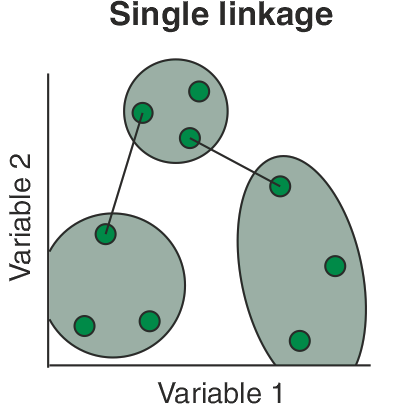
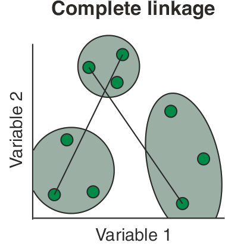
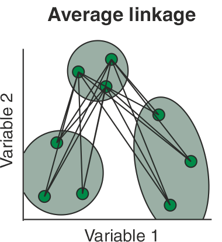
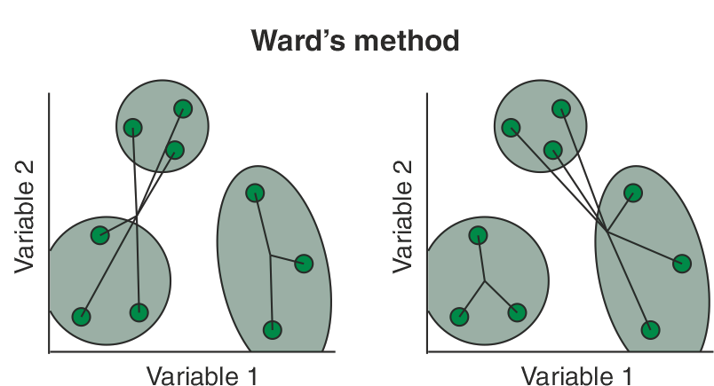

# Análisis de Conglomerados

```{r setup4, include = FALSE}
knitr::opts_chunk$set(echo = TRUE, warning = FALSE)
library(reticulate)
```

```{r, include=FALSE}
workingDir <-  "."
setwd(workingDir)
```

## Distancias y disimilitudes

Antes de entrar al tema de análisis de clústers es importante introducir los conceptos de distancias y disimilitudes o similitudes.

Una medida de *disimilitud o distancia* entre dos sujetos muy distintos será grande y por el contrario, una medida de *similitud* entre ellos será pequeña.

Una **distancia** es una función $d: \mathcal{X}\times \mathcal{X}\to \mathbb{R}$ que cumple las siguientes propiedades:

1) Para cualesquiera $x,y\in\mathcal{X}$ se tiene que $d(x,y)\geq 0$.

2) Se cumple que $d(x,y)=0$ si y sólo si $x=y$.

3) Para cualesquiera $x,y\in\mathcal{X}$ se cumple que $d(x,y) = d(y,x)$ (condición de simetría).

4) Para cualesquiera $x,y,z\in\mathcal{X}$ se cumple la desigualdad del triángulo:
     \[
          d(x,y)\leq d(x,z) + d(z,y).
     \]

Dos de las distancias más comunes en estadística para variables aleatorias multivariadas cuantitativas son la distancia euclidiana y la distancia de Mahalanobis:

1) Si $\bar{x},\bar{y}\in\mathbb{R}^n$, entonces la distancia euclidiana $d_E$ entre $\bar{x}$ y $\bar{y}$ está dada por
      \[
          d_E\left( \bar{x}, \bar{y} \right) = \left[ \left(\bar{x} - \bar{y}\right)'\cdot \left( \bar{x}- \bar{y} \right) \right]^{\frac{1}{2}}
      \]

2) Si $\bar{x},\bar{y}\in\mathbb{R}^n$, entonces la distancia de Mahalanobis $d_M$ entre $\bar{x}$ y $\bar{y}$ está dada por
      \[
          d_E\left( \bar{x}, \bar{y} \right) = \left[ \left(\bar{x} - \bar{y}\right)' \Sigma^{-1} \left( \bar{x}- \bar{y} \right) \right]^{\frac{1}{2}}
      \]
      donde $\Sigma^{-1}$ denota a la matriz inversa de la matriz de covarianzas de $\bar{x}$ y $\bar{y}$.
  
Existen otras distancias, como la distancia de Gower que puede ser utilizada para estudiar variables aleatorias con entradas cuantitativas y/o cualitativas.

Informalmente, una **similitud** es una medida entre dos objetos de que tanto se parecen. Por lo cual entre más parecidos sean los dos objetos su medida de similitud será más grande. Usualmente toma valores positivos entre 0 y 1.

Formalmente, una similitud es una función $s: \mathcal{X}\times \mathcal{X} \to \mathbb{R}$ que típicamente satisface las siguientes dos condiciones:

1) $s(x,y)=1$ si y sólo si $x=y$. Además $0\leq s\leq 1$.

2) $s(x,y)=s(y,x)$ para todo $x$ y $y$ (condición de simetría).

Usualmente, la función de similitud satisface $s(x,y)\geq 0$ pero existen ejemplos de similitudes que no lo satisfacen, por ejemplo: el coeficiente de correlación y los productos escalares. Sin embargo, si la función de similitud no es positiva y está acotada siempre es posible transformarla en una función de similitud positiva añadiendo una constante, es decir, podemos escribir nuestra nueva función de similitud $\tilde{s}$ como $\tilde{s}(x,y)=s(x,y)+c$, donde $c$ es una constante positiva lo suficientemente grande.

A diferencia de una distancia o una disimilitud, no existe un análogo para la desigualdad del triángulo para la similitud. 

Informalmente, una **disimilitud** entre dos objetos es una medida del grado en el cual dos objetos son diferentes. Como es de esperarse, una disimilitud debe ser baja si se consideran pares de objetos que son similares.

De manera precisa, una disimilitud es una función $d: \mathcal{X}\times \mathcal{X} \to \mathbb{R}$ que satisface las siguientes dos condiciones:

1) Para cualquier $x\in\mathcal{X}$ se tiene que $d(x,x) = 0$.

2) Para cualesquiera $x,y \in \mathcal{X}$ se cumple que $d(x,y)\geq 0$ (condición de no negatividad).

3) Para cualesquiera $x,y\in\mathcal{X}$ se cumple que $d(x,y) = d(y,x)$.
  
Es importante mencionar que, en la literatura de análisis de datos como _data mining_ y algunos textos de estadística, a las disimilitudes también se les nombra _distancias_, lo cual es incorrecto. Lo que si ocurre es que toda distancia (o métrica) es una disimilitud, pero no toda disimilitud es una distancia.

Algunas disimilitudes usuales de acuerdo al tipo de dato que se esté trabajando son las siguientes:

  - **Tipo nominal**: La disimilitud más sencilla es
  \[
      d(x,y) = \left\{
        \begin{matrix}
        0 & \text{ si } x= y \\
        1 & \text{ si } x\neq y
        \end{matrix}
      \right.
  \]
  
  - **Tipo ordinal**: La disimilitud más sencilla es
  \[
    d(x,y) = \frac{|x-y|}{n-1}
  \]
  donde suponemos que hay $n$ datos, y a cada uno de ellos se les ha asignado un valor entero de $0$ a $n-1$.
  
  - **Tipo intervalo**: La disimilitud más sencilla es
  \[
    d(x,y) = \| x- y\|
  \]
  donde $\| \cdot \|$ denota la distancia euclidiana usual.
  
  
A continuación se describen algunas de las distancias y disimilitudes más usuales entre individuos con datos numéricos, binarios, categóricos y mixtos.

### Distancia euclidiana

Es la distancia usual entre dos puntos en el espacio Euclidiano $\mathcal{X}$. Cumple las siguientes propiedades:

1) $d(X,Y)\geq 0$ para todo $X,Y\in \mathcal{X}$ y $d(X,Y)=0$ si y sólo si $X=Y$
2) $d(X,Y)=d(Y,X)$ para todo $X,Y\in\mathcal{X}$ (Simetría)
3) $d(X,Z)\leq d(X,Y) \ +\ d(Y,Z) $ para todo $X,Y,Z\in\mathcal{X}$(Desigualdad del triángulo)


**Tipos de datos:** Numéricos
  
**Fórmula y explicación:** Sea $\mathcal{X}$ el espacio euclidiano de dimensión $n$ y sean $X,Y\in\mathcal{X}$ dos puntos en el espacio con coordenadas $X=(x_1,...,x_{n})$ y $Y=(y_{1},...,y_{n})$. Entonces su distancia euclidiana esta dada por: 
   \[ d(X,Y)=\sqrt{\sum_{i=1}^{n}(x_{i}-y_{i})^{2}}\] 

### Distancia de Minkowski     

Es una generalización de la distancia euclidiana. Se llama así en honor al matemático Hermann Minkowski.

**Tipos de datos:** Numéricos.

**Fórmula y explicación:**Sean $X,Y\in\mathcal{X}$ dos puntos en el espacio con coordenadas $X=(x_1,...,x_{n})$ y $Y=(y_{1},...,y_{n})$ y sea $p$ un entero. Entonces su distancia Minkowski esta dada por: 
   \[ d(X,Y)=\left( \sum_{i=1}^{n} |\ x_{i}-y_{i}\ |^{p}\right)^{\frac{1}{p}}\] 
   Para $p\geq 1$ esta distancia es una métrica. Si $p<1$ no se satisface la desigualdad del triángulo y por lo tanto no es una métrica. Si $p=2$ es la distancia euclidiana y si $p=1$ es la distancia de Manhattan(o city block).

### Distancia City block

También se conoce como la distancia del taxista o distancia de Manhattan. Esta distancia no es única en el sentido de que hay más de un camino de distancia mínima para llegar de un punto a otro. Se le conoce como distancia del taxista o distancia de Manhattan porque hace referencia a la forma en que un automovil puede ir de un punto a otro en un diseño cuadricular de las calles de Manhattan. En la figura siguiente, podemos la distancia City block entre los puntos $X,Y$ esta representada con los colores rojo, azul y verde, los tres caminos tienen la misma longitud, mientras que la distancia en morado es la distancia euclidiana entre los puntos.

**Tipos de datos:** Numéricos

**Fórmula y explicación:** Sean $X,Y\in\mathcal{X}$ dos puntos en el espacio con coordenadas $X=(x_1,...,x_{n})$ y $Y=(y_{1},...,y_{n})$. Entonces su distancia city block esta dada por:
   \[ d_{1}(X,Y) = \parallel X - Y \ \parallel = \sum_{i=1}^{n} |\ x_{i} - y_{i}\ |  \]
   En el caso de la figura, la distancia de city block (en color azul, rojo o verde) sería $15$ si consideramos que cada cuadrito tiene longitud $1$. 
 
  
### Disimilitud calculando Simple Matching

El coeficiente de concordancia simple, llamado coeficiente *simple matching* ($\mathrm{SMC}$) o *coeficiente de Rand* se trata de la razón de coincidencias respecto al número total de valores. Se ofrece una ponderación igual a las coincidencias y a las no coincidencias. Toma valores entre $0$ y $1$. La disimilitud calculada vía simple matching o *distancia simple matching*, que mide la disimilitud entre las muestras, se calcula restando el $\mathrm{SMC}$ a $1$.

**Tipos de datos:** Binarios

**Fórmula y explicación:** Consideremos $A$ y $B$ dos objetos con $n$ atributos binarios, esto es, cada atributo vale $0$ o $1$. El número total para cada combinación de atributos para $A$ y $B$ se obtiene como sigue:

- Denotamos $M_{11}$ al número total de atributos donde $A$ y $B$ tienen un valor de $1$.

- Denotamos $M_{01}$ al número total de atributos donde $A$ vale $0$ y $B$ vale $1$.

- Denotamos $M_{10}$ al número total de atributos donde $A$ vale $1$ y $B$ vale $0$.

- Denotamos $M_{00}$ al número total de atributos donde $A$ y $B$ tienen un valor de $0$.
  
Entonces $M_{00}+ M_{01} + M_{10} + M_{11} = n$. La distancia *simple matching* $\mathrm{SMD}$ entre $A$ y $B$ se define como
   \[
      \mathrm{SMD} = 1 - \mathrm{SMC},
   \]
  donde $\mathrm{SMC}$ es el coeficiente *simple matching* dado por
   \[
      \mathrm{SMC} = \frac{M_{00} + M_{11}}{M_{00} + M_{01} + M_{10} + M_{11}}.
   \]

###  Disimilitud calculando el coeficiente de Jaccard 

El coeficiente de Jaccard fue presentado como *coefficient de communauté* por Paul Jaccard en 1912 y posteriormente fue formulado de manera independiente por T. Tanimoto en 1958, y toma valores entre $0$ y $1$. Se trata de un índice en el que no se toman en cuenta las ausencias conjuntas. Se ofrece una ponderación igual a las coincidencias y a las no coincidencias. Se conoce también como *razón de similaridad*.
   
La disimilitud de Jaccard (habitualmente conocida como *distancia de Jaccard*) se calcula restando el coeficiente de Jaccard a $1$. La distancia de Jaccard suele usarse para calcular una matriz $n\times n$ para la agrupación y el escalamiento multidimensional de $n$ conjuntos de muestras.

**Tipos de datos:** Binarios

**Fórmula y explicación:** Consideremos $A$ y $B$ dos objetos con $n$ atributos binarios, esto es, cada atributo vale $0$ o $1$. El número total para cada combinación de atributos para $A$ y $B$ se obtiene como sigue:

- Denotamos $M_{11}$ al número total de atributos donde $A$ y $B$ tienen un valor de $1$.

- Denotamos $M_{01}$ al número total de atributos donde $A$ vale $0$ y $B$ vale $1$.

- Denotamos $M_{10}$ al número total de atributos donde $A$ vale $1$ y $B$ vale $0$.

- Denotamos $M_{00}$ al número total de atributos donde $A$ y $B$ tienen un valor de $0$.

Entonces $M_{00}+ M_{01} + M_{10} + M_{11} = n$. La distancia de Jaccard $d_{J}$ se define como
   \[
      d_{J} = \frac{M_{01} + M_{10}}{M_{01} + M_{10} + M_{11}}.
   \]
   
   Se cumple que $d_{J} = 1- J$ donde $J$ es el índice (o coeficiente) de Jaccard dado por
   \[
      J = \frac{M_{11}}{M_{01} + M_{10} + M_{11}}.
   \]
   
   También, para fines del diseño, si $A$ y $B$ son conjuntos vacíos, entonces $d_{J} = 0$ (o equivalentemente, $J(A,B) = 1$).
   
### Disimilitud calculando el coeficiente de Czekanowski 

El coeficiente Czekanowski es uno en el que no se toman en cuenta las ausencias conjuntas y donde las coincidencias se ponderan doblemente en datos binarios. También se conoce como coeficiente de Dice, coeficiente de S{\o}rensen o coeficiente de S{\o}rensen--Dice (quienes los derivaron de manera independiente en 1948). Fue desarrollado en 1913 por Jan Czekanowski para establecer relaciones entre dialectos y lenguas, pero realmente se puede aplicar a cualquier comparación entre individuos calificados por múltiples atributos, por ejemplo, razas, especies de plantas o de animales, biocenosis, biotopos y hábitats, culturas, etc. La calificación puede ser cualitativa o cuantitativa y se basa en la comparación atributo por atributo de cada par de individuos de una colección. Este índice toma valores entre $0$ y $1$.
   
   La disimilitud asociada al coeficiente de Czekanowski se obtiene restando dicho índice a $1$. Contrario a la distancia de Jaccard, esta disimilitud no cumple la desigualdad del triángulo y por ello no es una distancia verdadera.

**Tipos de datos:**  Binarios

**Fórmula y explicación:** Consideremos $A$ y $B$ dos objetos con $n$ atributos binarios, esto es, cada atributo vale $0$ o $1$. El número total para cada combinación de atributos para $A$ y $B$ se obtiene como sigue:

- Denotamos $M_{11}$ al número total de atributos donde $A$ y $B$ tienen un valor de $1$.

- Denotamos $M_{01}$ al número total de atributos donde $A$ vale $0$ y $B$ vale $1$.

- Denotamos $M_{10}$ al número total de atributos donde $A$ vale $1$ y $B$ vale $0$.

- Denotamos $M_{00}$ al número total de atributos donde $A$ y $B$ tienen un valor de $0$.

La disimilitud asociada al coeficiente de Czekanowski se calcula como
   \[
      d_{Cz} = 1 - \frac{2M_{11}}{2M_{11} + M_{10} + M_{01}}
   \]
   
   De manera equivalente, al considerar la formulación dada por S{\o}ren y Dice, la disimilitud anterior se puede formular como
   \[
      d_{Cz} = 1 - \frac{2 |A\cap B|}{|A| + |B|}
   \]
   donde $|\cdot|$ denota la cardinalidad de los respectivos conjuntos.
   

###  Disimilitud de $1$-coincidencias de Sneath

   Medida de disimilitud propuesta en 1958 por Sneath y Sokal para variables binarias.  Cumple las propiedades de simetría entre $a$ y $d$ (atributos en que las unidades coinciden), mientras que su rango está entre 0 y 1. 

**Tipos de datos:** Binarios

**Fórmula y explicación:** \[
    d_{ij} = 1 - c_{ij}
   \]
   con
   \[
      c_{ij} = \frac{a+d}{a+b+c+d}
   \]
donde $a$ y $d$ son los atributos en que las unidades coinciden mientras el denominador es la suma de todos los valores de la tabla de contingencia. 

###  Distancia de Gower 

El coeficiente de similitud de Gower propuesto por Gower en 1971 permite la manipulación simultánea de variables cuantitativas y cualitativas en una base de datos, mediante la aplicación de este coeficiente se logra hallar la similitud entre individuos a los cuales se les han medido una serie de características en común. Una similaridad alta, es decir cercana a 1, indicara gran homogeneidad entre los individuos; por el contrario, una similaridad cercana a cero indica que los individuos son diferentes.

**Tipos de datos:**  Mixtos: variables cuantitativas y cualitativas

**Fórmula y explicación:**  
  \[
      d_{ij}^{2} = 1-s_{ij}
   \]
   donde
    \[
      s_{i j} = \frac{\sum\limits_{h=1}^{p_1}\left(1-\frac{\left|x_{ih}-x_{jh}\right|}{G_h}\right) + a + \alpha}{p_{1}+p_{2}-d+p_{3}}
    \]
con $p_1$ es el número de variables cuantitativas, $a$ y $d$ son el número de coincidencias en 1 (presencia de la característica) y el número de coincidencias en 0 (ausencia de la caracteristica) respectivamente para las $p_2$ variables binarias, $\alpha$ es el número de coincidencias para las $p_3$ variables cualitativas y $G_h$ es el rango de la $h$-ésima variable cuantitativa. 


## Clustering jerárquico

En muchos problemas no es factible examinar todas las posibles particiones de un conjunto de objetos, incluso con computadoras muy rápidas. Por ello se han desarrollado algoritmos de agrupamiento que permiten obtener grupos razonables sin evaluar todas las configuraciones posibles. Entre ellos destacan los métodos de clustering jerárquico.

Estos métodos generan una estructura en forma de árbol, llamada **dendrograma**, que muestra cómo se agrupan o dividen los objetos progresivamente, y el nivel (distancia) en el que lo hacen.

Existen dos enfoques principales:

1) **Métodos jerárquicos aglomerativos**: Comienzan con cada objeto como un grupo individual. El proceso es:

- Cada objeto constituye inicialmente un cluster.
- Se calculan las distancias entre todos los clusters.
- Se fusionan los dos clusters más similares.
- Se repite el proceso hasta obtener un único cluster.

Es decir, el algoritmo va desde varios clusters hasta uno solo.

2) **Métodos jerárquicos divisivos**: Funcionan de forma inversa:

- Se inicia con un único cluster que contiene a todos los objetos.
- Se divide el conjunto en dos subgrupos lo más disímiles posible.
- Se continúa dividiendo hasta llegar a clusters individuales.

Este enfoque desciende desde un solo cluster hacia muchos.

En este capítulo nos concentraremos en los métodos jerárquicos aglomeraticos, incluyendo:

  - **Single linkage agglomerative clustering** o método de la liga sencilla o del vecino más cercano.
  - **Complete linkage agglomerative clustering** o método de la liga completa o del vecino más lejano.
  - **Average linkage agglomerative clustering** o métdod de la liga promedio.
  - **Ward’s minimum variance clustering** o método Ward.


El algoritmo aglomerativo paso a paso, se puede entender como sigue:

Dado un conjunto de $N$ objetos:

1) Iniciar con $N$ clusters individuales y construir una matriz de distancias
    \[
    D = (d_{ij}).
    \]

2) Buscar el par de clusters $(U,V)$ cuya distancia $d_{UV}$ sea mínima.

3) Fusionar los clusters $U$ y $V$ formando un nuevo cluster $(UV)$.

4) Actualizar la matriz de distancias eliminando filas y columnas correspondientes a $U$ y $V$, y añadiendo la distancia del nuevo cluster con respecto a los restantes.

5) Repetir los pasos anteriores hasta obtener un único cluster.

El resultado final se representa en un dendrograma, donde se observan las uniones entre clusters y los niveles (distancias) a los que estas ocurren.


### Clustering aglomerativo de la liga sencilla


El método de **single linkage** (enlace simple o vecinos más cercanos) utiliza como criterio de similitud entre clusters la distancia mínima entre cualquiera de los elementos de los grupos involucrados,  es decir, se toma la mínima de todas las posibles distancias entre los objetos que pertenecen a distintos conglomerados. Inicialmente, debemos encontrar la distancia más pequeña $D = \{d_{ik}\}$ y unir los objetos correspondientes, es decir $U$ y $V$ para obtener el cluster $(UV)$. Después, para el paso 3 del algoritmo general, la distancia entre $(UV)$ y cualquier otro cluster $W$ se calcula como:
\[
d_{(UV),W} = \min\{d_{UW},d_{VW}\},
\]

donde $d_{UW}$ y $d_{VW}$ representan las distancias entre los vecinos más cercanos del cluster $U$ con respecto a los elementos de $W$, y del cluster $V$ con respecto a los elementos de $W$, respectivamente.

El proceso de aglomeración bajo este criterio se puede visualizar en un dendrograma. En dicho diagrama, las ramas representan clusters, y los nodos donde estas ramas se unen representan fusiones. La altura a la que se unen indica la distancia a la cual se fusionaron los clusters.





El resultado de la agrupación puede visualizarse como un *dendrograma*. El inconveniente del dendrograma resultante de un clustering de liga sencilla a menudo muestra el encadenamiento de las muestras. Los clústeres formados se ven forzados a unirse debido a que los elementos individuales están cerca unos de otros, mientras que muchos elementos de cada clúster pueden estar muy alejados entre sí. Otro inconveniente relevante del clustering de la liga sencilla es que podría ser difícil de interpretar en términos de particiones de los datos. Es una desventaja real del clustering de la liga sencilla porque estamos interesados en las particiones de los datos. Este método se tiende a desempeñar bien cuando hay grupos de forma elongada, conocidos como tipo cadena.

Veamos un ejemplo.

**Ejemplo 1:** Consideremos la siguiente matriz de distancias
\[
D = (d_{ik}) =
\begin{pmatrix}
0 & 9 & 3 & 6 & 11 \\
9 & 0 & 7 & 5 & 10 \\
3 & 7 & 0 & 9 & 2 \\
6 & 5 & 9 & 0 & 8 \\
11 & 10 & 2 & 8 & 0
\end{pmatrix}
\]

Inicialmente cada objeto se considera un cluster individual. Buscamos la menor distancia en la matriz $D$:

\[
\min_{i,k}(d_{ik}) = d_{53} = 2.
\]

Por lo tanto, los objetos $5$ y $3$ se fusionan y forman el cluster $(35)$.

Ahora se debe actualizar la matriz de distancias para este nuevo cluster. La distancia entre $(35)$ y los restantes objetos se calcula tomando el mínimo de las distancias existentes. Por ejemplo:

\[
d_{(35)1} = \min\{d_{31}, d_{51}\} = \min\{3, 11\} = 3,
\]

\[
d_{(35)2} = \min\{d_{32}, d_{52}\} = \min\{7, 10\} = 7,
\]

\[
d_{(35)4} = \min\{d_{34}, d_{54}\} = \min\{9, 8\} = 8.
\]

Eliminando filas y columnas correspondientes a $3$ y $5$, obtenemos una nueva matriz de distancias:

\[
\begin{array}{c|cccc}
N & (35) & 1 & 2 & 4 \\
\hline
(35) & 0 & 3 & 7 & 8 \\
1 & 3 & 0 & 9 & 6 \\
2 & 7 & 9 & 0 & 5 \\
4 & 8 & 6 & 5 & 0
\end{array}
\]

La distancia mínima entre estos clusters es ahora

\[
d_{(35)1} = 3.
\]

Entonces se fusiona el objeto $1$ con el cluster $(35)$, formando así $(135)$.

Se actualizan nuevamente las distancias:

\[
d_{(135)2} = \min\{d_{(35)2}, d_{12}\} = \min\{7, 9\} = 7,
\]

\[
d_{(135)4} = \min\{d_{(35)4}, d_{14}\} = \min\{8, 6\} = 6.
\]

La nueva matriz queda:

\[
\begin{array}{c|ccc}
N & (135) & 2 & 4 \\
\hline
(135) & 0 & 7 & 6 \\
2 & 7 & 0 & 5 \\
4 & 6 & 5 & 0
\end{array}
\]

La mínima distancia es ahora $d_{42} = 5$, por lo que los objetos $4$ y $2$ se fusionan formando $(24)$.

Finalmente, sólo quedan dos clusters: $(135)$ y $(24)$. Su distancia es:

\[
d_{(135)(24)} = \min\{d_{(135)2}, d_{(135)4}\} = \min\{7, 6\} = 6.
\]

De esta manera se obtiene la última fusión, y el clustering final reúne a los cinco individuos:

\[
(13524).
\]

**Nota:** Realicemos el dendrograma a mano primero, nos daremos cuenta de que muestra claramente las distancias a las que se produjeron las fusiones: primero a nivel $2$, luego a $3$, después a $5$ y finalmente a $6$.

En aplicaciones reales, es frecuente detener el proceso en un nivel intermedio del dendrograma, cuando el número de clusters resultante es interpretativamente significativo.

Veamos ahora el ejemplo en R.
```{r ac1, message=FALSE, warning=FALSE}
library(tidyverse)
```

```{r ac2}
A <- c(0,9,3,6,11)
B <- c(9,0,7,5,10)
C <- c(3, 7, 0, 9, 2)
D <- c(6, 5, 9, 0, 8 )
E <- c(11, 10, 2, 8, 0)

df <- data.frame(A,B,C,D,E, row.names = c("A","B","C","D","E"))
df %>% knitr::kable(format = "html")
```


```{r ac3, include=TRUE, echo=TRUE, out.width="80%", fig.align = "center", message=FALSE, fig.cap = 'Cluster con el método single.'}
dist <- as.dist(df, diag= TRUE)
cluster_single <- hclust (d = dist, method = 'single')
plot(cluster_single)
```

### Clustering aglomerativo de la liga completa


El método de **complete linkage** (o enlace completo o clustering del vecino más lejano) sigue el mismo procedimiento general que el método de enlace simple. Sin embargo, existe una diferencia fundamental: en cada etapa del algoritmo, la distancia entre dos clusters se define como la distancia (o disimilitud) máxima entre sus elementos.

Iniciamos de nuevo encontrando la distancia más pequeña y creando el primer clúster $UV$, de ahí calculamos la distancia entre un cluster formado por dos objetos $U$ y $V$ y otro cluster $W$, como:

\[
d_{(UV),W} = \max\{d_{UW},\,d_{VW}\}.
\]

Esto significa que la similitud entre dos clusters está determinada por el par de elementos más alejados entre ellos. De esta manera, el método de enlace completo garantiza que los objetos dentro de cada cluster no difieran entre sí más allá de una distancia máxima preestablecida.




La agrupación de la liga completa evita el inconveniente de encadenar las muestras por el método de la liga simple. El encadenamiento completo tiende a encontrar muchos pequeños grupos separados. Este método se desempeña bien cuando los conglomerados son de forma circular.


**Ejemplo 2:** Consideremos la misma matriz del ejemplo anterior:


\[
D = (d_{ik}) =
\begin{pmatrix}
0 & 9 & 3 & 6 & 11 \\
9 & 0 & 7 & 5 & 10 \\
3 & 7 & 0 & 9 & 2 \\
6 & 5 & 9 & 0 & 8 \\
11 & 10 & 2 & 8 & 0
\end{pmatrix}
\]


Identificamos los objetos más cercanos. Como antes,

\[
\min_{i,k}(d_{ik}) = d_{53} = 2,
\]

se fusionan los objetos $(3)$ y $(5)$ formando el cluster $(35)$.

Calculamos la distancia entre el cluster $(35)$ y los restantes objetos, ahora usando máximos:

\[
d_{(35),1} = \max\{d_{31}, d_{51}\} = \max\{3, 11\} = 11,
\]

\[
d_{(35),2} = \max\{d_{32}, d_{52}\} = \max\{7, 10\} = 10,
\]

\[
d_{(35),4} = \max\{d_{34}, d_{54}\} = \max\{9, 8\} = 9.
\]

Al eliminar filas y columnas de $3$ y $5$, la matriz queda:

\[
\begin{array}{c|cccc}
N & (35) & 1 & 2 & 4 \\
\hline
(35) & 0 & 11 & 10 & 9 \\
1 & 11 & 0 & 9 & 6 \\
2 & 10 & 9 & 0 & 5 \\
4 & 9 & 6 & 5 & 0
\end{array}
\]

La mínima distancia ahora es entre $(2)$ y $(4)$:

\[
d_{42} = 6.
\]

Se fusionan para formar el nuevo cluster $(24)$.


Calculamos distancias entre $(35)$ y $(24)$:

\[
d_{(24),(35)} = \max\{d_{2,(35)}, d_{4,(35)}\} = \max\{10, 9\} = 10.
\]

Queda además comparar con el objeto $(1)$:

\[
d_{(24),1} = \max\{d_{21}, d_{41}\} = \max\{9, 6\} = 9,
\]

La nueva matriz queda:

\[
\begin{array}{c|ccc}
 N & (35) & (24) & 1 \\
\hline
(35) & 0 & 10 & 11 \\
(24) & 10 & 0 & 9 \\
1 & 11 & 9 & 0
\end{array}
\]

La menor distancia es $9$, entre $(24)$ y $1$, de modo que se forma el cluster $(124)$.

Finalmente se compara con $(35)$:

\[
d_{(124),(35)} = \max\{ d_{1,(35)}, d_{(24),(35)}\} = \max\{11, 10\} = 11.
\]

Se obtiene el cluster total:

\[
(12345).
\]

**Nota:** Representamos este resultado en el dendrograma correspondiente.

Al comparar el dendrograma generado por enlace simple con el de enlace completo, se observa que la asignación del objeto $(1)$ a los grupos previos difiere entre métodos. Esto se debe a que:

- **Single linkage** prioriza la cercanía mínima entre pares de objetos.
- **Complete linkage** prioriza la máxima distancia entre elementos al agrupar.


Por ello, complete linkage tiende a formar clusters más compactos y homogéneos.

Realicemos el ejemplo en R.

```{r ac4,  include = TRUE, echo = TRUE, fig.pos = 'H', out.width="80%", fig.align = "center", message=FALSE, fig.cap = 'Cluster con el método complete.'}
cluster_complete <- hclust (d = dist, method = 'complete')
plot(cluster_complete)
```


### Clustering aglomerativo de la liga promedio


El método de **average linkage** (enlace promedio) define la distancia
entre dos clusters como el promedio de las distancias entre todos los pares
de objetos donde un miembro del par pertenece a cada cluster.

Supongamos que tenemos un cluster $(UV)$ y otro cluster $W$. La distancia
entre ellos se define como

\[
d_{(UV)W}
= \frac{\displaystyle\sum_{i \in (UV)} \sum_{k \in W} d_{ik}}
       {N_{(UV)}\,N_W},
\]

donde $d_{ik}$ es la distancia entre el objeto $i$ del cluster $(UV)$ y el
objeto $k$ del cluster $W$, mientras que $N_{(UV)}$ y $N_W$ son las
cardinalidades de los clusters $(UV)$ y $W$, respectivamente.

El algoritmo aglomerativo procede igual que antes:

1) Cada objeto es inicialmente un cluster.

2) Se busca el par de clusters con menor distancia.

3) Se fusionan esos clusters y se actualiza la matriz de distancias usando la fórmula de promedio anterior.

4) Se repiten los pasos 2 y 3 hasta que todos los objetos formen un solo cluster.




El clúster resultante del dendrograma tiene un aspecto intermedio entre una agrupación de enlace simple y una completa.

**Ejemplo 3:** Consideremos la matriz de los ejemplos anteriores.

\[
D = (d_{ik}) =
\begin{pmatrix}
0 & 9 & 3 & 6 & 11 \\
9 & 0 & 7 & 5 & 10 \\
3 & 7 & 0 & 9 & 2 \\
6 & 5 & 9 & 0 & 8 \\
11 & 10 & 2 & 8 & 0
\end{pmatrix}.
\]


Buscamos la distancia mínima (fuera de la diagonal). La menor entrada es

\[
\min_{i,k} d_{ik} = d_{35} = 2.
\]

Por tanto, fusionamos los objetos $3$ y $5$ para formar el cluster $(35)$.

Calculamos ahora las distancias entre el cluster $(35)$ y los objetos
restantes $1,2,4$. Como cada uno de éstos es un cluster de tamaño $1$,
tenemos:

\[
d_{(35),1}
= \frac{d_{31} + d_{51}}{2}
= \frac{3 + 11}{2}
= 7,
\]

\[
d_{(35),2}
= \frac{d_{32} + d_{52}}{2}
= \frac{7 + 10}{2}
= \frac{17}{2} = 8.5,
\]

\[
d_{(35),4}
= \frac{d_{34} + d_{54}}{2}
= \frac{9 + 8}{2}
= \frac{17}{2} = 8.5.
\]

La nueva matriz de distancias (con clusters $(35)$, $1$, $2$, $4$) es

\[
\begin{array}{c|cccc}
  N   & (35) & 1 & 2 & 4 \\\hline
(35) & 0   & 7   & 8.5 & 8.5 \\
1    & 7   & 0   & 9   & 6   \\
2    & 8.5 & 9   & 0   & 5   \\
4    & 8.5 & 6   & 5   & 0
\end{array}
\]

La mínima distancia ahora es

\[
d_{24} = 5,
\]

así que fusionamos los objetos $2$ y $4$ para obtener el cluster $(24)$.

Calculamos las distancias entre $(24)$ y los demás clusters $(35)$ y $1$.
Recordando que $N_{(24)} = 2$, $N_{(35)} = 2$ y $N_1 = 1$:

\[
d_{(24),1}
= \frac{d_{21} + d_{41}}{2}
= \frac{9 + 6}{2}
= \frac{15}{2} = 7.5,
\]

\[
d_{(24),(35)}
= \frac{1}{2\cdot 2}
\left(
d_{23} + d_{25} + d_{43} + d_{45}
\right)
= \frac{7 + 10 + 9 + 8}{4}
= \frac{34}{4} = 8.5.
\]

Ya habíamos calculado $d_{(35),1} = 7$ en la etapa anterior. La matriz
de distancias para los clusters $(35)$, $(24)$ y $1$ es

\[
\begin{array}{c|ccc}
  N   & (35) & (24) & 1 \\
\hline
(35) & 0   & 8.5  & 7   \\
(24) & 8.5 & 0    & 7.5 \\
1    & 7   & 7.5  & 0
\end{array}
\]


La menor distancia es

\[
d_{(35),1} = 7,
\]

por lo que se fusionan el objeto $1$ con el cluster $(35)$, obteniendo
el cluster $(135)$, de tamaño $N_{(135)}=3$.

Ahora sólo quedan dos clusters: $(135)$ y $(24)$. Calculamos su distancia:

\[
d_{(135),(24)}
= \frac{1}{3\cdot 2}
\sum_{i \in \{1,3,5\}} \sum_{k \in \{2,4\}} d_{ik}.
\]

Las distancias relevantes son

\[
d_{12}=9,\quad d_{14}=6,\quad
d_{32}=7,\quad d_{34}=9,\quad
d_{52}=10,\quad d_{54}=8.
\]

Por lo tanto,

\[
\sum d_{ik} = 9 + 6 + 7 + 9 + 10 + 8 = 49,
\]

y

\[
d_{(135),(24)} = \frac{49}{6} \approx 8.17.
\]

Al ser el único par de clusters restante, $(135)$ y $(24)$ se fusionan en
el nivel de distancia $49/6$, produciendo el cluster final $(12345)$.

El dendrograma resultante muestra fusiones sucesivas a los niveles de
distancia
\[
2,\quad 5,\quad 7,\quad \frac{49}{6}\approx 8.17,
\]
correspondientes, respectivamente, a las fusiones
\[
(3,5),\quad (2,4),\quad (1,(35)),\quad ((135),(24)).
\]

Este ejemplo ilustra cómo el criterio de **average linkage** utiliza
el promedio de todas las distancias entre pares de objetos de dos clusters,
lo cual suele producir grupos con un compromiso entre la compacidad de
**complete linkage** y la tendencia a cadenas de **single linkage**.

```{r ac5,  include = TRUE, echo = TRUE, fig.pos = 'H', out.width="80%", fig.align = "center", message=FALSE, fig.cap = 'Cluster con el método average.'}
cluster_average <- hclust (d = dist, method = 'average')
plot(cluster_average)
```

### Agrupación de varianza mínima de Ward


El método jerárquico propuesto por Ward (1963) se basa en minimizar la **pérdida de información** que ocurre cuando se fusionan dos clusters. Dicha pérdida de información se mide normalmente como el aumento en la suma de cuadrados del error (**Error Sum of Squares**, ESS). Este método sea conceptualmente análogo a un análisis de la varianza.


Sea $k$ un cluster cualquiera, y definamos

\[
ESS_k = \sum_{x_j \in k} (x_j - \bar{x}_k)'(x_j - \bar{x}_k),
\]

es decir, la suma de las desviaciones cuadráticas de los elementos del cluster con respecto a su centroide $\bar{x}_k$.

Si actualmente existen $K$ clusters, definimos

\[
ESS = ESS_1 + ESS_2 + \cdots + ESS_K.
\]


En cada etapa del algoritmo jerárquico se considera la posible unión de todos los pares de clusters, evaluando el incremento que dicha unión produciría en el valor total de $ESS$. El par de clusters que se fusiona es aquel cuya unión genera el menor incremento en $ESS$. De esta forma se garantiza que cada fusión produzca la mínima pérdida de información posible.


**Valores extremos del algoritmo:**

- Inicialmente, cada objeto es un cluster de tamaño uno, por lo que $ESS_k = 0$ para todos los clusters.
- En el otro extremo, cuando todos los objetos se encuentran en un único cluster, el valor final es
    \[
    ESS = \sum_{j=1}^N (x_j - \bar{x})'(x_j - \bar{x}),
    \]
    donde $\bar{x}$ es el vector promedio de todos los elementos.


**Interpretación geométrica:** El método de Ward está fundamentado en la idea de que los clusters resultantes deben ser aproximadamente de forma elíptica y compacta, pues la suma de cuadrados mide dispersiones alrededor de centros promedios. Por esta razón, Ward:

- tiende a producir grupos balanceados en tamaño;
- evita formar cadenas largas de puntos (como ocurre con **single linkage**);
- penaliza la incorporación de puntos alejados del centro del cluster.

**Representación gráfica:** Los resultados de Ward pueden visualizarse mediante un dendrograma. El eje vertical actúa como escala del incremento en $ESS$ asociado a cada fusión. Las alturas de los nodos indican el costo de unión de los clusters.


En resumen, el método de Ward es una versión jerárquica de técnicas de partición que buscan optimizar compactación dentro de los grupos. Es precursor directo de métodos no jerárquicos, tales como *k-means*, que minimizan variaciones internas utilizando centros promedio como referencia.

Este enfoque es particularmente adecuado para variables cuantitativas, ya que opera a partir de medidas basadas en medias y varianzas. Por ello, el método de Ward no resulta tan natural cuando las variables son binarias o categóricas sin transformar. Además, en su formulación clásica, la distancia inicial entre objetos corresponde a la distancia euclidiana al cuadrado, pues bajo dicha métrica la variación intra–grupo coincide estrictamente con la suma de cuadrados dentro del cluster.

Al final del proceso jerárquico, el dendrograma generado tiene como eje vertical los incrementos sucesivos en $ESS$, ilustrando el costo de cada fusión. Debido a su criterio de minimización de varianza, Ward tiende a producir clusters más compactos y equilibrados que los derivados de criterios basados en distancias mínimas (single linkage) o máximas (complete linkage).





```{r ac6,  include = TRUE, echo = TRUE, fig.pos = 'H', out.width="80%", fig.align = "center", message=FALSE, fig.cap = 'Cluster con el método Ward.'}
cluster_ward <- hclust (d = dist, method = 'ward.D2')
plot(cluster_ward)
```

Comparando los cuatro métodos:

```{r ac7,  include = TRUE, echo = TRUE, fig.pos = 'H', fig.height=10, fig.width=10,  fig.align = "center", message=FALSE, fig.cap = 'Comparación de los clusters con los 4 métodos.'}
# Correrlo en consola para visualizarlo mejor
par (mfrow = c(2,2))
plot(cluster_single)
plot(cluster_complete)
plot(cluster_average)
plot(cluster_ward)

par (mfrow = c(1,1))
```

¿Qué puedes decir al respecto si comparas el desempeño de estos 4 métodos?

### Mismos gráficos usando el paquete factoextra

```{r ac8, collapse=TRUE, echo=TRUE, fig.pos = 'H', fig.align = "center", message=FALSE, fig.cap = 'Heatmap de la matriz de distancias' }

library(factoextra)
fviz_dist(dist.obj = dist, lab_size = 8)
```


```{r  ac9}
set.seed(12345)
hc_single <- hclust(d=dist, method = "single")
hc_average <- hclust(d=dist, method = "average")
hc_complete <- hclust(d=dist, method = "complete")
hc_ward <- hclust(d=dist, method = "ward.D2")

## Otros dos métodos
hc_median <- hclust(d=dist, method = "median")
hc_centroid <- hclust(d=dist, method = "centroid")
```


```{r ac10, include = TRUE, echo = TRUE, fig.pos = 'H', fig.align = "center",out.width="80%", warning=FALSE, message=FALSE, fig.cap = 'Cluster con el método de la liga más sencilla.' }
fviz_dend(x = hc_single, k=3,
          cex = 0.7,
          main = "",
          xlab = "Samples",
          ylab = "Distance",
          sub = "",
          horiz = TRUE)+
  geom_hline(yintercept = 2.5, linetype = "dashed")
```

```{r ac11, include = TRUE, echo = TRUE, fig.pos = 'H', fig.align = "center",out.width="80%", warning=FALSE, message=FALSE, fig.cap = 'Cluster con el método de la liga completa.' }
fviz_dend(x = hc_complete, k=3,
          cex = 0.7,
          main = "",
          xlab = "Samples",
          ylab = "Distance",
          sub = "",horiz = TRUE)+
  geom_hline(yintercept = 6, linetype = "dashed")

```


```{r ac12, include = TRUE, echo = TRUE, fig.pos = 'H', fig.align = "center", out.width="80%", warning=FALSE, message=FALSE, fig.cap = ' Cluster con el método del promedio.'}
fviz_dend(x = hc_average, k=3, 
          cex = 0.7,
          main = "",
          xlab = "Samples",
          ylab = "Distance",
          sub = "",
          horiz = TRUE) +
  geom_hline(yintercept = 4, linetype = "dashed") 
```

```{r ac13, include = TRUE, echo = TRUE, fig.pos = 'H', fig.align = "center",out.width="80%", warning=FALSE, message=FALSE, fig.cap = ' Cluster con el método Ward.' }
fviz_dend(x = hc_ward, k=3,
          cex = 0.7,
          main = "",
          xlab = "Samples",
          ylab = "Distance",
          sub = "",
          horiz = TRUE)+
  geom_hline(yintercept = 6, linetype = "dashed")
```


```{r ac14, include = TRUE, echo = TRUE, fig.pos = 'H', fig.align = "center",out.width="80%", warning=FALSE, message=FALSE, fig.cap = ' Cluster con el método mediana.' }
fviz_dend(x = hc_median, k=3,
          cex = 0.7,
          main = "",
          xlab = "Samples",
          ylab = "Distance",
          sub = "",
          horiz = TRUE)+
  geom_hline(yintercept = 5, linetype = "dashed")
```

```{r ac15, include = TRUE, echo = TRUE, fig.pos = 'H', fig.align = "center",out.width="80%", warning=FALSE, message=FALSE, fig.cap = ' Cluster con el método del centroide.' }
fviz_dend(x = hc_centroid, k=3,
          cex = 0.7,
          main = "",
          xlab = "Samples",
          ylab = "Distance",
          sub = "",
          horiz = TRUE)+
  geom_hline(yintercept = 4.7, linetype = "dashed")
```


**Comentarios finales sobre los procedimientos jerárquicos**

Además de los métodos basados en enlace simple, completo o promedio, existen muchas otras variantes de clustering jerárquico aglomerativo; sin embargo, todas siguen esencialmente el algoritmo general descrito anteriormente: partir de $N$ grupos individuales y fusionar iterativamente los más similares.

Al igual que en otros procedimientos de clustering, los métodos jerárquicos pueden verse afectados por errores en los datos o por variabilidad no controlada. Esto implica que el resultado puede ser sensible a la presencia de valores atípicos o puntos ruidosos.

Una característica importante del clustering jerárquico es que no existe un mecanismo explícito de reubicación de elementos una vez que se han fusionado. Si un objeto se incorpora erróneamente a un cluster en una etapa temprana, dicho error persistirá hasta el final del proceso. Por esta razón, la interpretación del dendrograma debe realizarse cuidadosamente, evaluando si la estructura de grupos es razonable.

En la práctica, es recomendable aplicar diferentes métodos de clustering o utilizar distintos criterios de distancia dentro del mismo método. Si los resultados obtenidos son consistentemente similares, se puede argumentar con mayor confianza la presencia de grupos “naturales”.

La **estabilidad** de una solución jerárquica puede evaluarse mediante pequeñas perturbaciones a los datos (por ejemplo, añadiendo ruido controlado o repitiendo mediciones). Si los grupos son bien definidos, el dendrograma resultante debe permanecer similar después de la perturbación.

Finalmente, es posible que existan empates en valores de distancia entre pares de clusters, lo cual puede conducir a soluciones múltiples válidas. En estos casos, diferentes dendrogramas pueden representar distintas decisiones de fusión en niveles inferiores del árbol. Esto no necesariamente indica un problema metodológico, sino que refleja ambigüedad legítima en la estructura de similitudes del conjunto de datos. El usuario debe estar consciente de ello para interpretar adecuadamente las posibles estructuras de agrupamiento.


### Número óptimo de clústers

Para seleccionar la partición más adecuada de los datos, primero comparamos distintos métodos de agrupamiento jerárquico a partir de la calidad del dendrograma que generan. Dicha calidad se evaluó calculando el coeficiente de correlación cofenético entre la matriz de distancias original y las distancias cofenéticas derivadas del dendrograma correspondiente (véase Cuadro 5.1). Valores cercanos a 1 indican que la estructura jerárquica preserva adecuadamente las relaciones de proximidad originales entre las observaciones, por lo que el dendrograma constituye una buena representación de los datos.

Una vez seleccionado el dendrograma que mejor reproduce la estructura de distancias, el número óptimo de clústers se determinó mediante la inspección del dendrograma y la identificación de incrementos marcados en los niveles de fusión, los cuales sugieren separaciones naturales entre grupos. Adicionalmente, se evaluaron distintas particiones mediante criterios de validación interna, tales como el coeficiente de silhouette promedio, con el fin de corroborar la estabilidad y coherencia de la estructura obtenida.

Con este procedimiento combinado (fidelidad del dendrograma y evaluación de cohesión/separación) se seleccionó el número final de clústers a reportar.


```{r ac16}
#install.packages(c("purrr", "kableExtra"))
library(purrr)
library(kableExtra)
# vector con nombre de los métodos
m <- c( "average", "single", "complete", "ward.D2", "median", "centroid")
names(m) <- c( "average", "single", "complete", "ward.D2", "median", "centroid")
# Función para calcular el coeficiente de correlación
coef_cor <- function(x) {
  cor(x=dist, cophenetic(hclust(d=dist, method = x)))
}
# Tabla comparativa
coef_tabla <- map_dbl(m, coef_cor) 

kbl(coef_tabla, booktabs = TRUE, align = "c",
    caption = "Cuadro comparativo de los coeficientes de correlación",
    col.names = rownames(coef_tabla)) %>%
  kable_styling(position = "center",
                latex_options = c("repeat_header", "hold_position"),
                font_size = 9) %>%
  add_header_above(c("Método", "Coeficiente de correlación"))
```

A partir de los coeficientes de correlación cofenética (Cuadro 5.1), observamos que el dendrograma obtenido mediante el método `average` es el que mejor preserva la estructura de similitudes original entre las observaciones, seguido por el método `median`. Por este motivo, utilizamos el dendrograma generado con `average` como base para determinar la partición final.

Posteriormente, para determinar el número adecuado de clústers, utilizamos dos enfoques complementarios: el método del codo aplicado a la variación explicada y el paquete `NbClust`. Este último permite evaluar de manera simultánea un conjunto amplio de índices de validación (por ejemplo, Calinski–Harabasz, Dunn, Silhouette, entre otros), con el fin de sugerir el número de clústers más adecuado dentro de un rango especificado. Con base en la concordancia entre ambos enfoques, seleccionamos el número final de grupos a analizar.
 

```{r ac17, message=FALSE, warning=FALSE}
#install.packages("NbClust")
library(NbClust)
```

```{r ac18, include = TRUE, echo = FALSE, fig.pos = 'H', fig.dim = c(14,7), fig.align = "center", message=FALSE, fig.cap = 'Número óbtimo de clusters usando el método del codo' }
fviz_nbclust(x = df, FUNcluster = hcut, method = "wss", diss = dist, k.max = 3) +
  labs(title = "Número óptimo de clusters")

```

Podemos observar en la gráfica de codo que en 2 es donde se forma el codo, así que esto nos diría que debemos considerar 2 clústers.

Usando el paquete 'NbClust' se pueden obtener una comparación del número óptimo de clústers. Para el ejemplo que hemos estado realizando, no es posible aplicarle esto, pero lo que deberíamos de realizar es lo siguiente. 

```{r ac19, eval=FALSE, include = TRUE, echo = FALSE, fig.pos = 'H', fig.dim = c(14,7), fig.align = "center", message=FALSE, fig.cap = 'Número óbtimo de clusters usando el paquete NbClust' }
#basef_scaled <- scale(df)

res.nbclust <- NbClust(df, distance = "euclidean",
                       min.nc = 1, max.nc = 5, 
                       method = "ward.D2", index ="all")
factoextra::fviz_nbclust(res.nbclust) + theme_minimal() + ggtitle("Número óbtimo de clusters con NbClust")

```

## Ejercicios

**Ejercicio 1 (Ejemplo 12.2, Johnsonn y Wichern):** Ssimilitud entre 11 lenguas.

El significado de las palabras cambia a lo largo de la historia; sin embargo, el significado de los números $1,2,3,\dots$ se mantiene notablemente estable. Esto permite comparar lenguas utilizando únicamente las palabras para los numerales.

En la tabla siguiente se muestran las palabras que representan los números del 1 al 10 en once lenguas europeas modernas: inglés, noruego, danés, neerlandés, alemán, francés, español, italiano, polaco, húngaro y finés. 

(Únicamente se consideran lenguas que usan el alfabeto romano; se omiten acentos, diéresis, cedillas, etc.)

Una inspección rápida de la tabla sugiere que las primeras cinco lenguas (inglés, noruego, danés, neerlandés y alemán) son muy parecidas entre sí. 

Las lenguas francesa, española e italiana parecen guardar una similitud aún mayor entre ellas. 
Húngaro y finés parecen más aisladas, y el polaco comparte características con las lenguas de ambos subgrupos mayores.

```{r ac20}
library(knitr)

tabla1 <- data.frame(
  Ingles = c("one","two","three","four","five","six","seven","eight","nine","ten"),
  Noruego = c("en","to","tre","fire","fem","seks","sju","atte","ni","ti"),
  Danes = c("en","to","tre","fire","fem","seks","syv","otte","ni","ti"),
  Neerlandes = c("een","twee","drie","vier","vijf","zes","zeven","acht","negen","tien"),
  Aleman = c("eins","zwei","drei","vier","funf","sechs","sieben","acht","neun","zehn"),
  Frances = c("un","deux","trois","quatre","cinq","six","sept","huit","neuf","dix"),
  Espanol = c("uno","dos","tres","cuatro","cinco","seis","siete","ocho","nueve","diez"),
  Italiano = c("uno","due","tre","quattro","cinque","sei","sette","otto","nove","dieci"),
  Polaco = c("jeden","dwa","trzy","cztery","piec","szesc","siedem","osiem","dziewiec","dziesiec"),
  Hungaro = c("egy","ketto","harom","negy","ot","hat","het","nyolc","kilenc","tiz"),
  Fines = c("yksi","kaksi","kolme","neljä","viisi","kuusi","seitsemän","kahdeksan","yhdeksän","kymmenen")
)

kable(tabla1, caption = "Numerales del 1 al 10 en 11 lenguas europeas")

```

Para cuantificar la similitud entre dos lenguas podemos fijarnos únicamente en *la primera letra* de cada palabra. 
Diremos que dos palabras para el mismo número en dos lenguas distintas son *concordantes* si tienen la misma letra inicial y *discordantes* en caso contrario.

A partir de la Tabla anterior podemos construir una tabla de *concordancias* entre lenguas: para cada par de lenguas contamos cuántas veces (sobre los 10 numerales) coinciden las letras iniciales de sus palabras. 
El resultado se resume en la Tabla siguiente. Por ejemplo, el valor 8 en la celda $(\text{E},\text{N})$ indica que inglés y noruego comparten la misma letra inicial en 8 de los 10 numerales.

```{r ac21}
tabla2 <- data.frame(
  row.names = c("E","N","Da","Du","G","Fr","Sp","I","P","H","Fi"),
  E  = c(10,8,8,3,4,4,4,4,3,1,1),
  N  = c(8,10,9,5,6,4,4,4,3,2,1),
  Da = c(8,9,10,4,5,4,5,5,4,2,1),
  Du = c(3,5,4,10,5,1,1,1,0,2,1),
  G  = c(4,6,5,5,10,3,3,3,2,1,1),
  Fr = c(4,4,4,1,3,10,8,9,5,0,1),
  Sp = c(4,4,5,1,3,8,10,9,7,0,1),
  I  = c(4,4,5,1,3,9,9,10,6,0,1),
  P  = c(3,3,4,0,2,5,7,6,10,0,2),
  H  = c(1,2,2,2,1,0,0,0,0,10,1),
  Fi = c(1,1,1,1,1,1,1,1,2,1,10)
)
kable(tabla2, caption = "Concordancias entre primeras letras de los numerales (1--10)")
```


Los resultados de la Tabla anterior confirman la impresión visual de la primer tabla: inglés, noruego, danés, neerlandés y alemán parecen formar un grupo; francés, español, italiano y polaco podrían agruparse juntos, mientras que húngaro y finés parecen más aislados.

1) A partir de la tabla de concordancias 
        $\big(c_{ij}\big)$ de la Tabla ,
        construyan una matriz de *disimilitudes* definiendo, por ejemplo,
        \[
           d_{ij} = 10 - c_{ij},
        \]
        para $i \neq j$, y $d_{ii} = 0$. 
        (Es decir, mientras mayor sea el número de diferencias en las letras iniciales, mayor será la disimilitud entre las lenguas $i$ y $j$.)

2) Apliquen métodos de clustering jerárquico aglomerativo utilizando al menos los siguientes criterios de enlace:
  
  - enlace simple,
  
  - enlace completo,
  
  - enlace promedio,
  
  - método de Ward.

3) Para cada método de enlace:
 
 - Generen el dendrograma correspondiente a la matriz de disimilitudes $D = (d_{ij})$.
 
 - Calcule el coeficiente de correlación cofenético entre la matriz de disimilitudes original y las distancias cofenéticas del dendrograma.
 
4) Comparen los dendrogramas obtenidos y los valores de correlación cofenética. ¿Qué método produce el dendrograma que mejor preserva la estructura de similitudes entre las lenguas?

5) Usando el dendrograma seleccionado en el punto anterior:

  - Exploren distintos cortes del árbol para obtener diferentes números de clústers ($k=2,3,\dots$).
  
  - Utilicen el método del codo (basado en la suma de cuadrados intra–grupo) y, si lo desean, índices adicionales de validación interna (por ejemplo, silhouette promedio) para determinar el número más adecuado de clústers.

6) Finalmente, interpreten los clústers obtenidos:  

  - ¿Qué lenguas quedan agrupadas en cada clúster?  
  
  - ¿Coinciden los grupos encontrados con la impresión inicial basada en las dos tablas?


**Ejercicio 2:** Carga la base de datos USArrests. Obtén los dendrogramas y compara cuales realizan una mejor agrupación. ¿Cuál es el número óptimo de clusters?

```{r ac22, eval=FALSE}
#Código de la clase

library(tidyverse)
library(cluster)
library(factoextra)
library(ggplot2)
library(purrr)
library(NbClust)

# Cargar datos y analizar varianzas y correlaciones

data("USArrests")
any(is.na(USArrests))
summary(USArrests)
dim(USArrests)

var(data.matrix(USArrests))
cor.mat_all <- cor(data.matrix(USArrests), use="complete.obs")
cor.mat_all


# Escalar datos
US_df <- scale(USArrests)
var(US_df)

# Calcular distancias
dist <- dist(US_df, method = "euclidean")
head(dist)


# Realizar clusters
cluster_single <- hclust (d = dist, method = 'single')
plot(cluster_single,cex=0.7, hang = -2)

cluster_complete <- hclust (d = dist, method = 'complete')
plot(cluster_complete, cex=0.7, hang = -2)

cluster_average <- hclust (d = dist, method = 'average')
plot(cluster_average, cex=0.7, hang = -2)

cluster_ward <- hclust (d = dist, method = 'ward.D2')
plot(cluster_ward,cex=0.7, hang = -2)

par (mfrow = c(2,2))
plot(cluster_single,cex=0.7, hang = -2)
plot(cluster_complete,cex=0.7, hang = -2)
plot(cluster_average,cex=0.7, hang = -2)
plot(cluster_ward,cex=0.7, hang = -2)

par (mfrow = c(1,1))


# Comparar coeficiente de correlación de los métodos
# vector con nombre de los métodos
m <- c( "average", "single", "complete", "ward.D2", "median", "centroid")
names(m) <- c( "average", "single", "complete", "ward.D2", "median", "centroid")
# Función para calcular el coeficiente de correlación
coef_cor <- function(x) {
  cor(x=dist, cophenetic(hclust(d=dist, method = x)))
}
# Tabla comparativa
coef_tabla <- map_dbl(m, coef_cor) 
coef_tabla


# Calcular número óptimo de clusters
# Método del codo
fviz_nbclust(x = US_df, FUNcluster = hcut, method = "wss", diss = dist, k.max = 7) +
  labs(title = "Número óptimo de clusters") +
  xlab("Número de clústers")

# Aplicar todos los índices y métodos
res.nbclust <- NbClust(US_df, distance = "euclidean",
                       min.nc = 3, max.nc = 6, 
                       method = "average", index ="all")

# Realizar plot con el número óptimo de cluster y marcar los grupos
plot(cluster_average, cex = 0.6, hang = -2)
rect.hclust(cluster_average, k = 4, border = 2:8)

#fviz_nbclust(res.nbclust) + 
#  theme_minimal() + 
#  ggtitle("Número óbtimo de clusters con NbClust")


# Con Factoextra

# Matriz de distancias
fviz_dist(dist.obj = dist, lab_size = 8)

# Clusters
set.seed(12345)
hc_single <- hclust(d=dist, method = "single")
hc_average <- hclust(d=dist, method = "average")
hc_complete <- hclust(d=dist, method = "complete")
hc_ward <- hclust(d=dist, method = "ward.D2")
hc_median <- hclust(d=dist, method = "median")
hc_centroid <- hclust(d=dist, method = "centroid")


fviz_dend(x = hc_complete, k=4,
          cex = 0.7,
          main = "Cluster método complete",
          xlab = "Ciudades",
          ylab = "Distancias",
          type= "rectangle",
          sub = "",
          horiz = TRUE)+
  geom_hline(yintercept = 3.8, linetype = "dashed")


sub_grp <- cutree(hc_complete, k = 4)
table(sub_grp)


fviz_cluster(list(data = US_df, cluster = sub_grp))


# Comparar dendrogramas
library(dendextend)

hc_single <- agnes(US_df, method = "single") 
hc_complete <- agnes(US_df, method = "complete")

hc_single <- as.dendrogram(hc_single) 
hc_complete <- as.dendrogram(hc_complete)

tanglegram(rank_branches(hc_single),rank_branches(hc_complete),
           main_left = "Single",
           main_right = "Complete", lab.cex= 0.7, margin_inner = 5, k_branches = 4)


```


## Clustering no jerárquico

Los métodos de clustering no jerárquicos están diseñados para agrupar *observaciones* (ítems), más que variables, en una colección de $K$ clústers. El número de clústers $K$ puede fijarse de antemano o bien determinarse como parte del procedimiento de agrupamiento.

A diferencia de los métodos jerárquicos, en los métodos no jerárquicos no es necesario trabajar explícitamente con una matriz completa de distancias (o similitudes), ni almacenarla durante todo el proceso de cómputo. Esto permite aplicar estos métodos a conjuntos de datos mucho más grandes que los que suelen manejarse con técnicas jerárquicas.

En general, los métodos no jerárquicos parten de:

1) una partición inicial de los ítems en grupos, o

2) un conjunto inicial de "puntos semilla", que funcionarán como núcleos de los clústers.

Una buena elección de la configuración inicial es importante y, en la medida de lo posible, debe evitar sesgos evidentes. Una estrategia simple consiste en elegir aleatoriamente los puntos semilla entre las observaciones, o bien asignar aleatoriamente los ítems a grupos iniciales.

En esta sección consideramos uno de los procedimientos no jerárquicos más populares: el método de **$k$-means**.

### K-means

MacQueen introdujo el término *$k$-means* para describir un algoritmo que asigna cada observación al clúster cuyo centroide (media) sea más cercano. En su versión más simple, el proceso consta de los siguientes pasos:

1) *Partición inicial:* Dividir las observaciones en $K$ clústers iniciales (o bien elegir $K$ centroides iniciales).

2) *Asignación*: Recorrer la lista de observaciones y asignar cada una al clúster cuyo centroide esté más cerca. La distancia suele ser la euclidiana, usando ya sea datos estandarizados o sin estandarizar.

3) *Actualización:* Recalcular el centroide de cada clúster a partir de las observaciones que contiene tras la nueva asignación.

4) *Iteración*: Repetir los pasos 2 y 3 hasta que no se produzcan reasignaciones (o los cambios sean despreciables).

En lugar de comenzar con una partición inicial de todos los ítems en $K$ grupos (Paso 1), también es posible especificar directamente $K$ centroides iniciales (puntos semilla) y empezar el algoritmo a partir del Paso 2.

La asignación final de las observaciones a los clústers depende, en cierta medida, de la partición o de los centroides iniciales elegidos. La experiencia indica que la mayoría de los cambios importantes en la asignación ocurren durante las primeras iteraciones, y posteriormente el algoritmo tiende a estabilizarse.


**Ejemplo 1:** Supongamos que medimos dos variables $X_1$ y $X_2$ para cuatro ítems: A, B, C y D. Los datos se muestran en la tabla siguiente:

| Ítem |  x1  |  x2  |
|----|----|----|
|  A   |   5  |   3  |
|  B   |  -1  |   1  |
|  C   |   1  |  -2  |
|  D   |  -3  |  -2  |


El objetivo consiste en dividir estos ítems en $K = 2$ clústers, de modo que los elementos dentro de un clúster sean más similares entre sí que respecto a los elementos del otro clúster.

Para implementar el método $k$-means con $K=2$, iniciamos con una partición arbitraria. Supongamos que asignamos inicialmente:
\[
\text{Cluster 1: } (A,B), \qquad \text{Cluster 2: } (C,D).
\]

Entonces, el paso 1 sería calcular los centroides iniciales. Después, la reasignación usando distancia euclidiana y el nuevo cálculo de centroides, hasta terminar el proceso.

**Paso 1: Cálculo de centroides iniciales**

Calculamos los centroides (promedios) de cada clúster.

Para el clúster $(A,B)$:
\[
\bar{x}_1 = \frac{5 + (-1)}{2} = 2, 
\qquad
\bar{x}_2 = \frac{3 + 1}{2} = 2
\]
Por tanto, el centroide es:
\[
m_{AB} = (2,\,2).
\]

Para el clúster $(C,D)$:
\[
\bar{x}_1 = \frac{1 + (-3)}{2} = -1,
\qquad
\bar{x}_2 = \frac{-2 + (-2)}{2} = -2
\]
Por tanto, el centroide es:
\[
m_{CD} = (-1,\,-2).
\]

**Paso 2: Reasignación usando distancia euclidiana**

En el Paso 2, calculamos la distancia euclidiana de cada ítem al centroide de los grupos y reasignamos cada ítem al grupo más cercano. Si un ítem se mueve de la configuración inicial, los centroides deben actualizarse antes de continuar. La coordenada $i$-ésima del centroide, $i = 1,2,\dots,p$, se actualiza fácilmente usando las siguientes fórmulas:

\[
\bar{x}_{i, \text{new}} = \frac{n \bar{x}_i + x_{ji}}{n + 1}
\qquad
\text{si el ítem } j \text{ es añadido a un grupo},
\]

\[
\bar{x}_{i, \text{new}} = \frac{n \bar{x}_i - x_{ji}}{n - 1}
\qquad
\text{si el ítem } j \text{ es removido de un grupo}.
\]

Aquí $n$ es el número de ítems en el “grupo antiguo”, cuyo centroide es 
\[
\bar{x}' = (\bar{x}_1, \bar{x}_2,\dots, \bar{x}_p).
\]

Consideremos los clústers iniciales $(AB)$ y $(CD)$. Las coordenadas iniciales de los centroides eran $(2,2)$ y $(-1,-2)$ respectivamente. Supongamos que el ítem $A=(5,3)$ se mueve al grupo $(CD)$. Los nuevos grupos son $(B)$ y $(ACD)$ con centroides actualizados.

Para el grupo $(B)$ se tiene:

\[
\bar{x}_{1,\text{new}} = \frac{2(2) - 5}{2 - 1} = -1,
\qquad
\bar{x}_{2,\text{new}} = \frac{2(2) - 3}{2 - 1} = 1.
\]

Por lo tanto, las coordenadas del centroide de $(B)$ son:
\[
(-1,\,1).
\]


Para el grupo $(ACD)$ se obtiene:

\[
\bar{x}_{1,\text{new}} = \frac{2(-1) + 5}{2 + 1} = 1,
\qquad
\bar{x}_{2,\text{new}} = \frac{2(-2) + 3}{2 + 1} = -0.33.
\]

Así, las nuevas coordenadas del centroide de $(ACD)$ son:
\[
(1,\,-0.33).
\]


Volviendo a la asignación inicial del Paso 1, ahora calculamos las distancias al cuadrado:

\[
d^2(A,(AB)) = (5-2)^2 + (3-2)^2 = 10,
\]
si $A$ no se mueve.

\[
d^2(A,(CD)) = (5+1)^2 + (3+2)^2 = 61,
\]
si $A$ se moviera al grupo $(CD)$.

\[
d^2(A,(B)) = (5-(-1))^2 + (3-1)^2 = 40,
\]
si $A$ se moviera al nuevo grupo $(B).

\[
d^2(A,(ACD)) = (5-1)^2 + (3+0.33)^2 = 27.09.
\]

Como $A$ está más cerca del centro de $(AB)$ que del centro de $(ACD)$, no se reasigna.


Para el ítem $B$ se obtiene:

\[
d^2(B,(AB)) = (-1-2)^2 + (1-2)^2 = 10,
\]
si B no se mueve.

\[
d^2(B,(CD)) = (-1+1)^2 + (1+2)^2 = 9,
\]
si B se moviera a $(CD).
\]

\[
d^2(B,(A)) = (-1-5)^2 + (1-3)^2 = 40,
\]

\[
d^2(B,(BCD)) = (-1+1)^2 + (1+1)^2 = 4.
\]

Como $B$ está más cerca del centro de $(BCD)$ que del de $(AB)$, $B$ es reasignado al grupo $(CD)$.


Verificamos si $C$ debe reasignarse:

\[
d^2(C,(A)) = (1-5)^2 + (-2-3)^2 = 41,
\]

\[
d^2(C,(BCD)) = (1+1)^2 + (-2+1)^2 = 5.
\]

\[
d^2(C,(A)) = (1-3)^2 + (-2-5)^2 = 102.25,
\]

\[
d^2(C,(BCD)) = (1+2)^2 + (-2+5)^2 = 11.25.
\]

Como $C$ está más cerca del centro de $(BCD)$ que del centro de $(A)$, no se mueve.

Continuando de esta manera, no se producen más reasignaciones y los clústers finales son $(A)$ y $(BCD)$.

Tabla final de distancias al cuadrado al centroide

| Cluster | A  | B  | C  | D  |
|---------|----|----|----|----|
| A       | 0  | 40 | 41 | 89 |
| (BCD)   | 52 | 4  | 5  | 5  |


La suma total de cuadrados dentro de los clústers (WSS) es:

Para el clúster A:
\[
0
\]

Para el clúster (BCD):
\[
4 + 5 + 5 = 14.
\]

Equivalentemente, podemos determinar $K=2$ clústers usando el criterio:

\[
\min E = \sum_{i} d^2_{i,c(i)},
\]

donde la suma es sobre todos los ítems y $d^2_{i,c(i)}$ es la distancia al cuadrado entre el ítem $i$ y el centroide del clúster asignado.

En este ejemplo existen siete posibilidades de partición para $K = 2$ clústers:

A , (BCD)  
B , (ACD)  
C , (ABD)  
D , (ABC)  
(AB) , (CD)  
(AC) , (BD)  
(AD) , (BC)  


Para la partición $A,(BCD)$ se tiene:

\[
d^2_{A,c(A)} = 0,
\]

para $(BCD)$:

\[
d^2_{B,c(B)} + d^2_{C,c(C)} + d^2_{D,c(D)} = 4 + 5 + 5 = 14.
\]

Entonces:

\[
\sum_i d^2_{i,c(i)} = 0 + 14 = 14.
\]

Para las restantes particiones se tiene:

B,(ACD) \quad $\sum d^2_{i,c(i)} = 48.7$

C,(ABD) \quad $\sum d^2_{i,c(i)} = 27.7$

D,(ABC) \quad $\sum d^2_{i,c(i)} = 31.3$

(AB),(CD) \quad $\sum d^2_{i,c(i)} = 28$

(AC),(BD) \quad $\sum d^2_{i,c(i)} = 27$

(AD),(BC) \quad $\sum d^2_{i,c(i)} = 51.3$

Dado que la suma mínima $\sum d^2_{i,c(i)}$ ocurre para los grupos $(A)$ y $(BCD)$, esta es la solución final.


Veamos unos ejemplos en R.

**Ejemplo 1**: Usaremos la matriz del ejemplo pasado.

```{r ac23}
df <- data.frame(
  x1 = c(5, -1, 1, -3),
  x2 = c(3,  1, -2, -2),
  row.names = c("A", "B", "C", "D")
)

df

```

Para realiazar kmeans en R, usamos la función `kmenas`.
```{r ac24}
set.seed(123)  # para reproducibilidad

km2 <- kmeans(df, centers = 2, nstart = 20)  
```

El parámetro `nstart = 20` indica que intenta 20 configuraciones iniciales y se queda con la mejor.

La variable `km2` tiene guardada toda la información de este algoritmo.

```{r ac25}
km2

km2$cluster   # a qué cluster quedó asignado cada punto
km2$centers   # coordenadas de los centroides
km2$withinss  # suma de cuadrados dentro de cada cluster
km2$tot.withinss  # suma total de cuadrados dentro de los clusters
```

Podemos hacer un plot de estos clústers.

```{r ac26}
data.frame(
  Item    = rownames(df),
  x1      = df$x1,
  x2      = df$x2,
  Cluster = km2$cluster
)

# Especificamos colores por cluster
cols <- c("steelblue", "tomato")[km2$cluster]

# Usando R base
plot(df$x1, df$x2,
     col = cols,
     pch = 19,
     xlab = "x1", ylab = "x2",
     main = "Clustering k-means con K = 2")
text(df$x1, df$x2, labels = rownames(df),
     pos = 3)

# Podemos añadir centroides
points(km2$centers[,1], km2$centers[,2],
       pch = 8, cex = 2, lwd = 2)
```

Otra forma de hacerlo, es con el paquete `factoextra`.

```{r ac27}
library(factoextra)
# debemos asegurarnos que nuestro df tenga como rownames los nombres de los items

#df_named <- df
#df_named$label <- rownames(df_named)

fviz_cluster(
  km2, 
  data = df, #df_named
  repel = TRUE,
  labelsize = 6,
  main = "Clusters k-means con etiquetas"
) 
```


**Ejemplo 2:** En este ejemplo se aplicará el algoritmo de K-means utilizando el conjunto de datos USArrests, disponible en R. Antes de realizar la agrupación, es necesario preparar el conjunto de datos asegurando que solo incluya variables numéricas continuas, ya que el método de K-means se basa en promedios y distancias entre observaciones. 
Además, para evitar que las diferencias en escala entre las variables influyan en la formación de los grupos, por ejemplo, debido a que algunas variables se miden en unidades mucho mayores que otras, los datos se estandarizan utilizando la función `scale()` de R. Esta transformación permite que todas las variables contribuyan de manera equitativa al proceso de agrupación.


```{r ac28}
data("USArrests")      
df <- scale(USArrests) # escalamos los datos 
df
```


La función `kmeans()` es la encargada de ejecutar el algoritmo de K-means en R. Los principales argumentos de entrada:

- `x`: Conjunto de datos a utilizar para la agrupación. Puede ser una matriz numérica, un data frame numérico o un vector numérico.

- `centers`: Indica el número de clústers deseados (k) o bien un conjunto de centroides iniciales. Si se especifica un número, el algoritmo selecciona aleatoriamente filas distintas de x como centroides iniciales.

- `iter.max`: Número máximo de iteraciones permitidas para la ejecución del algoritmo. Su valor por defecto es 10.

- `nstart`: Cantidad de asignaciones iniciales aleatorias que se generan cuando centers es un número. Se recomienda usar un valor mayor que 1 para obtener soluciones más estables.

```{r ac29}
library(ggplot2)
library(factoextra)
```

Vamos a estimar primero la cantidad óptima de clústers usando el método del codo.

```{r ac30}
fviz_nbclust(df, kmeans, method = "wss") + 
  geom_vline(xintercept = 4, linetype = 2)
```

El gráfico anterior representa cómo cambia la variabilidad interna de los grupos conforme aumenta el número de clústers $k$. Como es esperable, al incrementar el número de clústers la variación dentro de cada grupo disminuye. No obstante, se identifica un punto de inflexión alrededor de $k=4$, donde la reducción de la varianza deja de ser tan significativa. Este punto, conocido como el método del codo, sugiere que a partir de $k=4$ añadir más clústers no aporta mejoras sustanciales en la homogeneidad interna. Por ello, se considera que el valor adecuado de $k$ para estos datos es aproximadamente 4.

Como al inicializar el algoritmo, se seleccionan al aleatoriamente los centroides, debemos inicializar una semilla.

```{r ac31}
set.seed(123)
km.res <- kmeans(df, 4, nstart = 25)
```

Al establecer `nstart = 25`, R realizará 25 asignaciones de inicio aleatorias y luego seleccionará los resultados que correspondan a la asignación con la variación más baja dentro de los clusters. El valor predeterminado de `nstart` es 1, lo que significa que solo se realiza una asignación aleatoria inicial.

```{r ac32}
print(km.res)
```

Calculemos la media de cada variable para cada cluster utilizando los datos originales.

```{r ac33}
aggregate(USArrests, by=list(cluster=km.res$cluster), mean)
```

Podemos agregarle a la base de datos originales una columna que nos indique en que clúster quedó cada observación.

```{r ac34}
dd <- cbind(USArrests, cluster = km.res$cluster)
head(dd)
```

Cuando se trabaja con más de dos variables, una forma de visualizar los grupos obtenidos mediante clustering es reducir la dimensionalidad con un método como el Análisis de Componentes Principales. 

Usando las dos primeras componentes principales como ejes, es posible construir un diagrama de dispersión en dos dimensiones y colorear los puntos según el clúster asignado. Esta visualización facilita interpretar la estructura de los datos, comparar distintas particiones y evaluar si el número de clústers elegido resulta apropiado.

```{r ac35}
fviz_cluster(km.res, data = df,
             palette = c("#FF0000", "#0000FF", "#000000", "#C870FF"),
             ellipse.type = "euclid", # Agregar elipses
             star.plot = TRUE, # Añadir segmentos desde los centroides a los datos
             repel = TRUE, # que no se sobrelapen
             ggtheme = theme_minimal())
```


### Ejercicios

**Ejercicio 1:** Los siguientes datos fueron colectados en 22 compañías públicas de EU en 1975. Estandarizar las variables. Ajustar modelos k-means para 4 y 5 clústers. Reportar: tamaño de cada clúster, empresas en cada clúster, distancias entre centroides y proporción de variación explicada. Comparar la calidad de la partición (dentro vs. entre clústers). Puedes comentar cuál de los dos K “separa mejor” (ratio más grande) y si esa mejora justifica pasar de 4 a 5 clústers. Busca el “codo” de la curva y comenta si K=4 o K=5 son valores razonables. Interpretar los clústers: ¿qué variables parecen distinguir más los grupos? ¿qué tipo de empresas se agrupan juntas (por tamaño, porcentaje nuclear, ventas, etc.)?


| ID | Company | X1 | X2 | X3 | X4 | X5 | X6 | X7 | X8 |
|---|---|---|---|---|---|---|---|---|---|
| 1 | Arizona Public Service | 1.06 | 9.2 | 151 | 54.4 | 1.6 | 9077 | 0   | 0.628 |
| 2 | Boston Edison Co. | 0.89 | 10.3 | 202 | 57.9 | 2.2 | 5088 | 25.3 | 1.555 |
| 3 | Central Louisiana Electric Co. | 1.43 | 15.4 | 113 | 53.0 | 3.4 | 9212 | 0   | 1.058 |
| 4 | Commonwealth Edison Co. | 1.02 | 11.2 | 168 | 56.0 | 0.3 | 6423 | 34.3 | 0.700 |
| 5 | Consolidated Edison Co. (N.Y.) | 1.49 | 8.8 | 192 | 51.2 | 1.0 | 3300 | 15.6 | 2.044 |
| 6 | Florida Power & Light Co. | 1.32 | 13.5 | 111 | 60.0 | -2.2 | 11127 | 22.5 | 1.241 |
| 7 | Hawaiian Electric Co. | 1.22 | 12.2 | 175 | 67.6 | 2.2 | 7642 | 0   | 1.652 |
| 8 | Idaho Power Co. | 1.10 | 9.2 | 245 | 57.0 | 3.3 | 13082 | 0   | 0.309 |
| 9 | Kentucky Utilities Co. | 1.34 | 13.0 | 168 | 60.4 | 7.2 | 8406 | 0   | 0.862 |
| 10 | Madison Gas & Electric Co. | 1.12 | 12.4 | 197 | 53.0 | 2.7 | 6455 | 39.2 | 0.623 |
| 11 | Nevada Power Co. | 0.75 | 7.5 | 173 | 51.5 | 6.5 | 17441 | 0   | 0.768 |
| 12 | New England Electric Co. | 1.13 | 10.9 | 178 | 62.0 | 3.7 | 6154 | 0   | 1.897 |
| 13 | Northern States Power Co. | 1.15 | 12.7 | 199 | 53.7 | 6.4 | 7179 | 50.2 | 0.527 |
| 14 | Oklahoma Gas & Electric Co. | 1.09 | 12.0 | 96  | 49.8 | 1.4 | 9673 | 0   | 0.588 |
| 15 | Pacific Gas & Electric Co. | 0.96 | 7.6 | 164 | 62.2 | -0.1 | 6468 | 0.9 | 1.400 |
| 16 | Puget Sound Power & Light Co. | 1.16 | 9.9 | 252 | 56.0 | 9.2 | 15991 | 0   | 0.620 |
| 17 | San Diego Gas & Electric Co. | 0.76 | 6.4 | 136 | 61.9 | 9.0 | 5714 | 8.3 | 1.920 |
| 18 | The Southern Co. | 1.05 | 12.6 | 150 | 56.7 | 2.7 | 10140 | 0   | 1.108 |
| 19 | Texas Utilities Co. | 1.16 | 11.7 | 104 | 54.0 | -2.1 | 13507 | 0   | 0.636 |
| 20 | Wisconsin Electric Power Co. | 1.20 | 11.8 | 148 | 59.9 | 3.5 | 7287 | 41.1 | 0.702 |
| 21 | United Illuminating Co. | 1.04 | 8.6 | 204 | 61.0 | 3.5 | 6650 | 0   | 2.116 |
| 22 | Virginia Electric & Power Co. | 1.07 | 9.3 | 174 | 54.3 | 5.9 | 10093 | 26.6 | 1.306 |


Clave de variables:

$X_1$: Razón de cobertura de cargos fijos (ingreso/deuda).

$X_2$: Tasa de retorno sobre el capital.

$X_3$: Costo por kW de capacidad instalada.

$X_4$: Factor de carga anual.

$X_5$: Crecimiento máximo de demanda en kWh de 1974 a 1975.

$X_6$: Ventas (kWh utilizadas por año).

$X_7$: Porcentaje de generación nuclear.

$X_8$: Costo total de combustible (centavos por kWh).


```{r ac36}
utilities <- data.frame(
  ID = 1:22,
  Company = c(
    "Arizona Public Service",
    "Boston Edison Co.",
    "Central Louisiana Electric Co.",
    "Commonwealth Edison Co.",
    "Consolidated Edison Co. (N.Y.)",
    "Florida Power & Light Co.",
    "Hawaiian Electric Co.",
    "Idaho Power Co.",
    "Kentucky Utilities Co.",
    "Madison Gas & Electric Co.",
    "Nevada Power Co.",
    "New England Electric Co.",
    "Northern States Power Co.",
    "Oklahoma Gas & Electric Co.",
    "Pacific Gas & Electric Co.",
    "Puget Sound Power & Light Co.",
    "San Diego Gas & Electric Co.",
    "The Southern Co.",
    "Texas Utilities Co.",
    "Wisconsin Electric Power Co.",
    "United Illuminating Co.",
    "Virginia Electric & Power Co."
  ),
  X1 = c(1.06, 0.89, 1.43, 1.02, 1.49, 1.32, 1.22, 1.10, 1.34, 1.12,
         0.75, 1.13, 1.15, 1.09, 0.96, 1.16, 0.76, 1.05, 1.16, 1.20,
         1.04, 1.07),
  X2 = c(9.2, 10.3, 15.4, 11.2, 8.8, 13.5, 12.2, 9.2, 13.0, 12.4,
         7.5, 10.9, 12.7, 12.0, 7.6, 9.9, 6.4, 12.6, 11.7, 11.8,
         8.6, 9.3),
  X3 = c(151, 202, 113, 168, 192, 111, 175, 245, 168, 197,
         173, 178, 199, 96, 164, 252, 136, 150, 104, 148,
         204, 174),
  X4 = c(54.4, 57.9, 53.0, 56.0, 51.2, 60.0, 67.6, 57.0, 60.4, 53.0,
         51.5, 62.0, 53.7, 49.8, 62.2, 56.0, 61.9, 56.7, 54.0, 59.9,
         61.0, 54.3),
  X5 = c(1.6, 2.2, 3.4, 0.3, 1.0, -2.2, 2.2, 3.3, 7.2, 2.7,
         6.5, 3.7, 6.4, 1.4, -0.1, 9.2, 9.0, 2.7, -2.1, 3.5,
         3.5, 5.9),
  X6 = c(9077, 5088, 9212, 6423, 3300, 11127, 7642, 13082, 8406, 6455,
         17441, 6154, 7179, 9673, 6468, 15991, 5714, 10140, 13507, 7287,
         6650, 10093),
  X7 = c(0.0, 25.3, 0.0, 34.3, 15.6, 22.5, 0.0, 0.0, 0.0, 39.2,
         0.0, 0.0, 50.2, 0.0, 0.9, 0.0, 8.3, 0.0, 0.0, 41.1,
         0.0, 26.6),
  X8 = c(0.628, 1.555, 1.058, 0.700, 2.044, 1.241, 1.652, 0.309, 0.862, 0.623,
         0.768, 1.897, 0.527, 0.588, 1.400, 0.620, 1.920, 1.108, 0.636, 0.702,
         2.116, 1.306)
)

```

**Ejercicio 2:** Utilizando el conjunto de datos `mtcars`, incluido por defecto en R, que contiene información sobre distintas características de automóviles: consumo de gasolina, cilindrada, caballos de fuerza, peso, etc. Aplica k-means para identificar posibles grupos de automóviles con características mecánicas similares.


**Ejercicio 3:** El conjunto de datos Iris es un clásico en biología y machine learning.  Incluye mediciones de tres especies de flores del género Iris: Setosa, versicolor y virginica. Consta de 4 variables: sepal length, sepal width, petal length, petal width. Aplicar k-means para identificar patrones naturales en las mediciones de las flores y compararlos con las especies reales.

<details>
<summary><b>Solución en Python</b></summary>
```{python, eval=FALSE}
from sklearn.datasets import load_iris
from sklearn.preprocessing import StandardScaler
from sklearn.cluster import KMeans
import pandas as pd
import matplotlib.pyplot as plt

# Cargar dataset 
iris = load_iris()
X = iris.data
y = iris.target
feature_names = iris.feature_names

# Convertir a DataFrame
df = pd.DataFrame(X, columns=feature_names)
df["species"] = y

# Escalar
scaler = StandardScaler()
X_scaled = scaler.fit_transform(X)

# Aplicar K-means con k=3
kmeans = KMeans(n_clusters=3, n_init=20, random_state=42)
labels = kmeans.fit_predict(X_scaled)

df["cluster"] = labels

print("Centros de los clusters (estandarizados):")
print(kmeans.cluster_centers_)

print("\nTamaño de cada cluster:")
print(df["cluster"].value_counts())

# Visualización
plt.figure(figsize=(7,5))
scatter = plt.scatter(
    df["sepal length (cm)"],
    df["petal length (cm)"],
    c=df["cluster"], s=80
)

plt.xlabel("Largo del sépalo")
plt.ylabel("Largo del pétalo")
plt.title("k-means en el dataset Iris (k = 3)")
plt.colorbar(scatter, label="Cluster")
plt.tight_layout()
plt.show()
```

</details>


## Otros métodos

Otros métodos de clustering son por ejemplo [DBSCAN](https://rpubs.com/elias_jurgen/605966) y [UMAP](https://umap-learn.readthedocs.io/en/latest/clustering.html). Existen también métodos basados en modelos estadísticos, una buena referencia es el libro de Johnson y Wichern.

## Ejemplo Completo

Según el diccionario de la Real Academia Española (RAE, 2014), bienestar proviene de la unión de las palabras bien y estar. Es el conjunto de las cosas necesarias para vivir bien. También lo define como vida holgada o abastecida de cuanto conduce a pasarlo bien y con tranquilidad. 

El presente trabajo tiene por objetivo analizar el bienestar de manera multivariante y territorial, para tal cometido se ha tomado varias dimensiones que afectan al bienestar como la marginación, la pobreza, la desigualdad.  Adicionalmente se toma en consideración al desarrollo humano que es una medida que favorece al bienestar.  

A nivel territorial se ha tomado los datos de Ecuador provenientes del Censo de Población y Vivienda 2010.  Se  usará por tanto una base de datos denominada `base.csv` que contiene las diferentes dimensiones a ser estudiadas. 

Usaremos la base de datos `base.csv` con las siguientes variables:
  
- Región natural: Costa, Sierra, Amazonía y Galápagos.

- Estado: 24 estados.

- Municipio: 24 capitales de estados. 

-	Dimensión 1: Porcentaje de población de 15 años o más analfabeta.

-	Dimensión 2: Porcentaje de población de 15 años o más sin primaria completa.

-	Dimensión 3: Porcentaje de ocupantes en viviendas particulares habitadas sin drenaje ni servicio sanitario.

-	Dimensión 4: Porcentaje de ocupantes en viviendas particulares habitadas sin energía eléctrica.

-	Dimensión 5: Porcentaje de ocupantes en viviendas particulares habitadas sin agua entubada.

-	Dimensión 6: Porcentaje de viviendas particulares habitadas con algún nivel de hacinamiento.

-	Dimensión 7: Porcentaje de ocupantes de viviendas particulares habitadas con piso de tierra.

-	Dimensión 8: Porcentaje de población ocupada con ingresos de hasta dos salarios mínimos

-	Densidad poblacional: habitantes por $Km^{2}$
  
- IDH: Índice de Desarrollo Humano

- Pobre: pobreza por consumo (%)

- Gini: Índice de desigualdad

Para iniciar con nuestros análisis, cargamos la base de datos que utilizaremos.

```{r base_datos, message=FALSE, warning=FALSE}
library(readr)
base <- read_csv("D:/Users/hayde/Documents/R_sites/MultivariateStatisticalAnalysis/data/base.csv")

base2 <- base[,c(2,4:16)]
```

en esta sección se describen gráficos multivariados. Se muestran las gráficas paralelas, que representa correlación entre variables, donde cada línea es una observación o individuo. 

Dado que en Ecuador existen cuatro regiones, a saber: la Sierra, Amazonía, la Costa e Insular, cada una se colorea con distintos tonos, a fin de visualizar los cambios por variable. Se aprecia que  la variable sobre la proporción de piso de tierra es la que tiene la tasa más baja, seguida por el porcentaje de población sin educación primaria completa.

Así mismo, se vislumbra que la región con el porcentaje más bajo de variables que reflejan vulnerabilidad es la Insular, seguida por la región de Sierra. Mientras que la Amazonía es la región con mayor vulnerabilidad, al presentar porcentajes más altos. 

Por otra parte, se distingue que hay correlación entre las variables de pobreza, piso de tierra, al menos dos salarios mínimos, y las relativas a la educación. Esto se ve ya que hay líneas paralelas, lo que implica un patrón en el país. En contraste, hay cruce entre líneas entre las vairables de porcentaje de población sin primaria completa, el índice de gini, y el Índice de Desarrollo humano. 

<details>
<summary><b>Plot de paralelas</b></summary>
```{r, parellel plot, include = TRUE, echo = TRUE,  fig.pos = 'H', fig.dim = c(9,7), out.width="80%", fig.align = "center", message=FALSE, fig.cap = 'Gráfico de paralelas'}
library(GGally)
ggparcoord(base, columns = c(8, 9, 16, 7, 15, 10, 14, 13, 6, 11, 5, 12),  
           groupColumn = 2, showPoints = TRUE, 
           title = "",
           alphaLines = 1, scale = "uniminmax"
#           order = "Outlying"
) 

```
</details>

Se muestra otro tipo de esquema. En las gráficas de estrellas, cada una es un estado, y la longitud de los "brazos" implica el rango de la variable. Se aprecia que aquellas regiones con estrellas más grandes en variables de marginación (i1-i8), son las mismas con estrellas más pequeñas para variables que expresan bienestar (como el índice de gini, idh, y densidad  poblacional).

<details>
<summary><b>Plot de estrellas</b></summary>
```{r, grafica estrellas, include = TRUE, echo = TRUE,  fig.pos = 'H', fig.dim = c(9,7), out.width="99%", fig.align = "center", message=FALSE, fig.cap = 'Gráfico de estrellas'}
par(mfrow= c(2,2))#cuatro tipos de gráficas

#Se segmenta a las variables en función del factor que expresan. 
stars(base2[, 3:7],len = 1.3, key.loc = c(-1,11), lwd = 1, col.segments = T, col.lines = 1:24, )
stars(base2[, c(7:10, 13)],len = 1.3, key.loc = c(-1,11), lwd = 1, col.segments = T, col.lines = 1:24, )
stars(base2[, c(11:12,14)], scale = T, len = 1.3, key.loc = c(-1,11), lwd = 1, col.segments = T, col.lines = 1:24)
```
</details>

El siguiente gráfico muestra la correlación entre variables. Se ha tachado las variables que no son significantes. 

```{r, include = TRUE, echo = TRUE, fig.pos = 'H', fig.dim = c(8,5), fig.align = "center", message=FALSE, fig.cap = 'Correlograma con significancia'}
library(corrplot)
cor_base <- cor(base2[,3:14], use="complete.obs")

cor.mtest <- function(mat, ...) {
    mat <- as.matrix(mat)
    n <- ncol(mat)
    p.mat<- matrix(NA, n, n)
    diag(p.mat) <- 0
    for (i in 1:(n - 1)) {
        for (j in (i + 1):n) {
            tmp <- cor.test(mat[, i], mat[, j], ...)
            p.mat[i, j] <- p.mat[j, i] <- tmp$p.value
        }
    }
  colnames(p.mat) <- rownames(p.mat) <- colnames(mat)
  p.mat
}
# matrix of the p-value of the correlation
p.mat <- cor.mtest(cor_base)

corrplot(cor_base, type = "upper", order = "hclust", tl.col = "black", tl.srt = 45, p.mat = p.mat, sig.level = 0.05)
```

### Análisis de componentes principales


El análisis de componenetes principales tiene como objetivo reducir la dimensión y conservar en lo posible su estructura, es decir la ”forma” de la nube de datos para esto el primer paro es obtener la matriz de correlaciones y la matriz de covarianzas.

Cuando se trabaja con distintas unidades de medición, conviene hacer el análisis de componentes principales haciendo los cálculos con la matriz R de correlaciones. 

Calculamos primero la matriz de correlación.

```{r, include = TRUE, echo = TRUE, fig.cap="Gráfico de correlaciones", out.width = '70%', fig.pos = 'H', fig.align = "center"}
base.cp1 <- data.matrix(base2)
res1 <- cor.mtest(base.cp1, conf.level= .95)
res2 <- cor.mtest(base.cp1, conf.level= .99)
cor.mat <- cor(base2[,c(3:14)], use="complete.obs")

corrplot(cor.mat)

```

La prueba de Kaiser-Meyer-Olkin (KMO) es una medida de qué tan adecuados son sus datos para el análisis factorial . La prueba mide la adecuación del muestreo para cada variable en el modelo y para el modelo completo. La estadística es una medida de la proporción de varianza entre variables que podrían ser varianza común.

Como referencia, Kaiser puso los siguientes valores en los resultados:

0.00 a 0.49 inaceptable.
0.50 a 0.59 miserable.
0,60 a 0,69 mediocre.
0.70 a 0.79 medio.
0,80 a 0,89 meritorio.
0.90 a 1.00 maravilloso.

En nuestro caso observamos que al remover las variables "dp", "gini", "i2" e "i7" el valor del test KMO sube de 0.62 a 0.79, por este motivo decidimos remover estas variables para los análisis siguientes, ademas en la grafica de la matriz de correlaciones podemos observar que para las variables i7 i2 no se observa correlación con la mayoría de las otras variables.

```{r, include = TRUE, echo = TRUE}
library(psych)
library(dplyr)
base.cp1 <- base2[, 3:14]
kmo.1 <-KMO(base.cp1)
kmo.1
base.cp1 <- base.cp1 %>%
    dplyr::select(-i2, -i7, -dp, -gini)

kmo.2 <- KMO(base.cp1)
kmo.2
```

```{r, include = TRUE, echo = TRUE, fig.cap="Gráfico de correlaciones ajustado", out.width = '70%', fig.pos = 'H', fig.align = "center"}
cor.mat.aj <- cor(base.cp1, use = "complete.obs")
corrplot(cor.mat.aj)
```
Vamos a proceder a realizar el análisis de componentes principales.


```{r, include = TRUE, echo = TRUE}
nombre.mun <- base2$municipio

rownames(base.cp1)<- nombre.mun
data.matrix(base.cp1) 
cp1 <- princomp(base.cp1, cor=TRUE)
summary(cp1)

```
Con la instrucción `loadings` lo que obtenemos son las cargas de los componentes principales. Es decir, lo que obtenemos son los coeficientes que se usarán en las combinaciones lineales para calcular cada componente principal. Por ejemplo, para un conjunto de datos $X_1, X_2,..., X_p$ la primera columna que está denotada por `Comp.1` tiene los coeficientes $\phi_{11}, \phi_{21},... ,\phi_{p1}$ de la combinación lineal con la que se obtiene la primera componente principal:
$$Z_1=\phi_{11}X_1+\phi_{21}X_2+... +\phi_{p1}X_p$$ 
Esta primera componente principal será la que refleje la mayor variabilidad de los datos. 

```{r loadings, include = TRUE, echo = TRUE}
load.base.cp1 <- cp1$loadings
load.base.cp1
```

En la primera fila de la instrucción `summary` tenemos la desviación estándar, para calcular la varianza debemos elevar al cuadrado cada una de las entradas. 

```{r varianza, include = TRUE, echo = TRUE}
varianza.cp1 <- (cp1$sdev)^2
varianza.cp1
```


Para obtener la proporción de la varianza que explica cada componente lo que tenemos que hacer es dividir el valor de la varianza de la componente $j$ entre la suma de las varianzas de todas las componentes. 
El siguiente código muestra como realizarlo. Además, en la instrucción `summary` vemos que estos valores coinciden con los de la segunda fila.

```{r proporcion_varianza, include = TRUE, echo = TRUE}
proporcion.varianza.cp1 <- (cp1$sdev)^2/sum((cp1$sdev)^2)
proporcion.varianza.cp1
```

```{r porcentaje_varianza_total_cada_cp, include = TRUE, echo = TRUE}
#si lo que queremos es el porcentaje, entonces solo hay que multiplicar por 100
porcentaje_varianza <- (cp1$sdev)^2*100/sum((cp1$sdev)^2)
```

Para encontrar la proporción de varianza acumulada, lo que tenemos que hacer es dividir la suma de los primeros $j-$ésimos eigenvalores entre entre la suma de todos los eigenvalores. 

```{r acumulada_varianza, include = TRUE, echo = TRUE}
proporcion_acumulada_varianza <- cumsum(proporcion.varianza.cp1)
```


```{r, include = TRUE, echo = TRUE}
eigen_base <- (eigen(cor.mat.aj)) #cálculamos eigen de la matriz cuadrada de correlación
```

La varianza de las Componentes Principales, es igual a los eigenvalores. 
Es decir, la desviación estándar de las componentes, es igual a la raiz de los valores propios. 
```{r, include = TRUE, echo = TRUE}
 desv_base <- cp1$sdev

desv_rounded_base <- round(cp1$sdev, 1)
```

```{r, include = TRUE, echo = TRUE}
round(sqrt(eigen_base$values),1) == desv_rounded_base
```

Por otra parte, se puede afirmar que la traza de la matriz lambda es igual a la suma de la varianza de cada valor observado.
```{r, include = TRUE, echo = TRUE}
lambda_matriz <- round(diag(eigen_base$values), 2)
lambda_matriz
traza_lambda <- sum(diag(lambda_matriz))
traza_lambda
```

Además, el porcentaje de la varianza generalizada que es explicado por la componente $j$-ésima es igual a la relación que hay entre los  eigenvalores divididos por la suma de la diagonal de eigenvalores (que la traza es igual a 8). Es decir, esto es igual al porcentaje de varianza acumulada por la función `summary`, y hecho a mano con la suma acumulada de los valores propios.

```{r, include = TRUE, echo = TRUE}
cumsum(eigen_base$values/traza_lambda) 
```


Esta matriz es la diagonal con los eigenvalores.
```{r, include = TRUE, echo = TRUE}
lambda_matriz <- round(diag(eigen_base$values), 2)
lambda_matriz
```


La traza de la matriz $\Lambda$ es igual a la suma de las varianzas acumuladas por los Componentes.
```{r, include = TRUE, echo = TRUE}
traza_lambda <- sum(diag(lambda_matriz))
traza_lambda
```


```{r grafico_codo_pca, include = TRUE, echo = TRUE, fig.cap="Gráfico de codo", out.width = '60%', fig.pos = 'H', fig.align = "center"}
library(factoextra)

res.pca <- prcomp(base.cp1)

fviz_eig(res.pca)
```

Recordemos que la regla de Kaiser consiste en tomar todas las componentes cuya varianza sea mayor a 1. Esto se debe a que si consideramos variables son independientes, entonces las componentes principales serán las mismas que las de las variables originales y para el caso de la matriz de correlación todas tendrán varianza 1. Entonces cualquier componente con varianza menor a 1 tiene menos información que las variables originales. 

La librería `nFactors` tiene implementada la regla de Kaiser.
```{r, include = TRUE, echo = TRUE}
library(nFactors)
ev_cor <- eigen(cor.mat.aj)
ap <- parallel(subject=nrow(base.cp1),var=ncol(base.cp1),
               rep=100,cent=.05)
num_cp <- nScree(x=ev_cor$values, aparallel=ap$eigen$qevpea, cor = TRUE)
num_cp
```

Bajo la regla de Kaiser nos quedamos con 2 componentes unicamente.

```{r, include = TRUE, echo = TRUE, fig.cap="Biplot 1ra y 2da componente", out.width = '130%', fig.pos = 'H', fig.align = "center"}
fviz_pca_biplot(cp1, repel = TRUE, habillage=base2$region, gradient.cols = c("#00AFBB", "#E7B800", "#FC4E07")
)

fviz_pca_biplot(cp1, repel = TRUE, 
                habillage=base2$region, 
                addEllipses=TRUE,
                ellipse.level=0.6, 
                col.var = "brown"
)

```
Podemos observar en el biplot que todos los indicadores de pobreza apuntan al lado derecho, podríamos concluir que los municipios mas pobres serían Orellana, Tena y Guaranda, asi como el indice de desarrollo humano apunta hacia el lado izquierdo, dado que es un valor que en concepto es contrario a los indicadores de pobreza, en este sentido observamos que las ciudades menos pobres son: Quito, que es la capital. San Cristobal y Cuenca. Esta dristribución correlaciona con lo que se observará en los análisis de factores y clusters.

Podemos tambien obsrvar que las ciudades se agruparon en gran medida de acuerdo a la region a la que pertenecen, es decir si son parte de la region de la Amazonía, de la costa, la sierra o forman parte de la región insular.

Los indicadores i4 (%hogares sin energía eléctrica), i5 (%hogares sin servicio de agua entubada) e i6 (%hogares con algun nivel de hacinamiento), se puede observar que estar tres dimensiones apuntan hacia el cuarto cuadrante que es donde se agrupan las ciudades que se encuantran en la region de la Amazonía, una probable hipótesis, sería que las condiciones geográficas específicas de esta region encarecen o dificultan la construcción de infraestructura básica para poder otorgar servicios de electricidad, agua entubada y la construccion de vivienda.

Los indicadores i1 (% de poblacion de 15 años o mas analfabeta), i3 (% de ocupantes sin servicio de drenaje ni servicio sanitario), e i8 (porcentaje de poblacion coupada con 2 salarios mínimos o menos), estos indicadores apuntatan hacia el cuadrante 1 donde las ciudades ubicadas en esta direccion son predominantemente ciudades en la region de la sierra, lo cual podría sugerir como hipotesis que en esta region la infraestructura para escuelas o la disponibilidad de maestros sería menor a las otras regiones, en el caso del i3, la deficiencia hace referencia a la infraestructura de servicios basicos, y se encuantra muy cercana al cuadrante 4 junto con los otrs indicadores de carencias en cuaestion de viviendas. el indicador i8 que habla de la percepcion economica de las personas observamos que se encuentra en el cuadrante 1 y podriamos cuncluir que la ciudad de Guaranda es la de menor ingreso económico, aunque tambien es la que presenta una situación de pobreza mayor al resto de ciudades.

El indicador de Indice de Desarrollo Humano IDH como se mencionó anteriormente es un indicador contrario a los indicadores de pobreza antes mencionados, por eso no es de sorprendernos que apunte en dicreccion contraria, ademas es interesante observar que practicamente forma un vector horizontal al eje ordenado, podrias plantear como hipótesis que el IDH representa un buen parametro para medir la No pobreza de las ciudades analizadas.


### Análisis de clústers

Vamos ahora a realizar el análisis de clústers. Este tipo de análisis nos permite encontar grupos dentro de un conjunto de observaciones. Estos grupos se forman de tal manera que las observaciones que quedan dentro de un mismo grupo tienen características similares entre si y diferentes a las de otros grupos. 

Todos los métodos de clúster tienen en común que para poder realizar los grupos deben de definir lo que es que dos observaciones esten cerca o no. Para esto lo que se hace es definir una similitud o disimilitud entre las observaciones. En este caso, decidimos trabajar con la métrica euclidiana para obtener la matriz de distancias y así poder definir si dos ciudades estaban cerca o no de acuerdo a las variables estudiadas. Para calcular la matriz de distancias usamos la función `dist` del paquete `stats`. 


```{r matriz_de_distancia, include = TRUE, echo = TRUE}
mat_dist<- dist(x=base.cp1, method = "euclidean")
matriz_dist <- as.matrix(mat_dist)
```


En el gráfico siguiente podemos visualizar la matriz de distancias y podemos empezar a darnos cuenta que si se forman ciertos grupos. Las intensidades azules indican que la disimilitud entre las ciudades es alta y las intensidades rojas que la disimilitud es baja.

```{r visualizar_matriz, collapse=TRUE, include = TRUE, echo = TRUE, fig.pos = 'H', fig.align = "center", message=FALSE, fig.cap = 'Heatmap de la matriz de distancias' }

fviz_dist(dist.obj = mat_dist, lab_size = 5)
  #theme(legend.position = "none")+
  
```

Ahora, vamos a generar los clústers con diferentes métodos para analizar cual es el más conveniente en este caso.  

```{r  clusters, include = TRUE, echo = TRUE}
set.seed(12345)
hc_single <- hclust(d=mat_dist, method = "single")
hc_average <- hclust(d=mat_dist, method = "average")
hc_complete <- hclust(d=mat_dist, method = "complete")
hc_ward <- hclust(d=mat_dist, method = "ward.D2")
hc_median <- hclust(d=mat_dist, method = "median")
hc_centroid <- hclust(d=mat_dist, method = "centroid")
```

Procedemos a graficar sus respectivos dendrogramas.

```{r dendograma_average, include = TRUE, echo = TRUE, fig.pos = 'H', fig.dim = c(14,7), fig.align = "center", message=FALSE, fig.cap = 'Dendrograma usando el método de Promedio'}
fviz_dend(x = hc_average,
          cex = 0.4,
          main = "",
          xlab = "Municipios",
          ylab = "Distancia",
          sub = "",
          horiz = TRUE)
```

```{r dendograma_Ward, include = TRUE, echo = TRUE, fig.pos = 'H', fig.dim = c(14,7), fig.align = "center", message=FALSE, fig.cap = 'Dendrograma usando el método de Ward' }
fviz_dend(x = hc_ward,
          cex = 0.3,
          main = "",
          xlab = "Municipios",
          ylab = "Distancia",
          sub = "",
          horiz = TRUE)
```


```{r dendograma_single, include = TRUE, echo = TRUE, fig.pos = 'H', fig.dim = c(14,7), fig.align = "center", message=FALSE, fig.cap = 'Dendrograma usando el método del vecino más cercano' }
fviz_dend(x = hc_single,
          cex = 0.4,
          main = "",
          xlab = "Municipios",
          ylab = "Distancia",
          sub = "",
          horiz = TRUE)
```

```{r dendograma_complete, include = TRUE, echo = TRUE, fig.pos = 'H', fig.dim = c(14,7), fig.align = "center", message=FALSE, fig.cap = 'Dendrograma usando el método de complete' }
fviz_dend(x = hc_complete,
          cex = 0.4,
          main = "",
          xlab = "Municipios",
          ylab = "Distancia",
          sub = "",horiz = TRUE)

```


```{r dendograma_median, include = TRUE, echo = TRUE, fig.pos = 'H', fig.dim = c(14,7), fig.align = "center", message=FALSE, fig.cap = 'Dendrograma usando el método de mediana' }
fviz_dend(x = hc_median,
          cex = 0.4,
          main = "",
          xlab = "Municipios",
          ylab = "Distancia",
          sub = "",horiz = TRUE)
```


```{r dendograma_centroide, include = TRUE, echo = TRUE, fig.pos = 'H', fig.dim = c(14,7), fig.align = "center", message=FALSE, fig.cap = 'Dendrograma usando el método del centroide'}
fviz_dend(x = hc_centroid,
          cex = 0.4,
          main = "",
          xlab = "Municipios",
          ylab = "Distancia",
          sub = "",horiz = TRUE)
```


Después de analizar los distintos dendrogramas para las diferentes ligas, en los que se aprecian mejor los grupos son los métodos de `ward` y `average`. Para evaluar cual dendrograma reflejaba mejor las distancias originales entre las observaciones, calculamos el coeficiente de correlación entre las distancias cofenéticas del dendrograma y la matriz de distancias originales, esta información está en el cuadro siguiente. Entre más cercano este el coeficiente de correlación a 1 nos indica que el dendrograma refleja mejor las distancias originales. 


```{r comparacion_coef, collapse=TRUE, include = TRUE, echo = TRUE}
library(kableExtra)
library(purrr)
# vector con nombre de los métodos
m <- c( "average", "single", "complete", "ward.D2", "median", "centroid")
names(m) <- c( "average", "single", "complete", "ward.D2", "median", "centroid")
# Función para calcular el coeficiente de correlación
coef_cor <- function(x) {
  cor(x=mat_dist, cophenetic(hclust(d=mat_dist, method = x)))
}
# Tabla comparativa
coef_tabla <- map_dbl(m, coef_cor) 

kbl(coef_tabla, booktabs = TRUE, align = "c",
    caption = "Cuadro comparativo de los coeficientes de correlación",
    col.names = rownames(coef_tabla)) %>%
  kable_styling(position = "center",
                latex_options = c("repeat_header", "hold_position"),
                font_size = 9) %>%
  add_header_above(c("Método", "Coeficiente de correlación"))

```

Podemos observar que el dendrograma que mejor refleja la similitud entre las observaciones es la del método `average` y el segundo mejor es el del método `ward`. Decidimos usar el dendrograma de `Ward` ya que es en el que se visualizan mejor los grupos que se forman.

Para determinar cuantos grupos nos conviene más tomar, usamos dos métodos: el método del codo y el paquete `NbClust`. Este paquete usa 30 índices para determinar el número más relevante de clústers variando todas las combinaciones de número de clústers, distancias y métodos. 

```{r num_clusters_codo, include = TRUE, echo = TRUE, fig.pos = 'H', fig.dim = c(14,7), fig.align = "center", message=FALSE, fig.cap = 'Número óbtimo de clusters usando el método del codo' }
fviz_nbclust(x = base.cp1, FUNcluster = hcut, method = "wss", diss = mat_dist, k.max = 7) +
  labs(title = "Número óptimo de clusters")

```

Podemos observar en la gráfica de codo que en 3 es donde se forma el codo, así que esto nos diría que debemos considerar 3 clústers.

Usando el paquete 'NbClust' obtenemos los siguientes resultados. En la última gráfica de barras que se muestra es claro que deberíamos tomar 3 clústers. 

```{r num_clusters_NbClust, include = TRUE, echo = TRUE, fig.pos = 'H', fig.dim = c(14,7), fig.align = "center", message=FALSE, fig.cap = 'Número óbtimo de clusters usando el paquete NbClust' }
library(NbClust)

basef_scaled <- scale(base.cp1)

res.nbclust <- NbClust(basef_scaled, distance = "euclidean",
                       min.nc = 2, max.nc = 9, 
                       method = "ward.D2", index ="all")

best <- as.data.frame(res.nbclust$Best.nc)
clusters <- as.numeric(best["Number_clusters", ])
freq <- as.data.frame(table(clusters))
colnames(freq) <- c("clusters", "freq")

ggplot(freq, aes(x = clusters, y = freq)) +
  geom_col(fill = "#2E9FDF") +
  theme_minimal() +
  labs(
    x = "Número de clusters",
    y = "Frecuencia como óptimo",
    title = "Número óptimo de clusters según índices de NbClust"
  )

```

Entonces, el mejor número de cluster que podemos tomar es 3. Vamos a proceder a encontrar el punto de corte del dendrograma y a identificar los grupos.

El valor de $y$ al cual tomaremos el corte se obtiene como el promedio de las alturas obtenidas entre el grupo $3$ y el grupo $4$.

```{r, include = TRUE, echo = TRUE}
y <- round((hc_ward$height[22] + hc_average$height[21]) / 2, 5)
y
```

Por lo tanto, el corte debe realizarse al nivel $y =$ `r y`. En el dendograma pueden identificarse los grupos que se forman al realizar dicho corte.

```{r grupos_dendograma, include = TRUE, echo = TRUE, fig.pos = 'H', fig.dim = c(14,7), fig.align = "center", message=FALSE, fig.cap = 'Dendrograma con 3 grupos'}
fviz_dend(x = hc_ward,
          k = 3,
          k_colors = c("#DE3A17", "#00AFBB", "#1131E7"),
          color_labels_by_k = TRUE,
          rect_border = c("#2E9FDF", "#00AFBB", "#E7B800", "#FC4E07"),
          cex = 0.4,
          xlab = "Municipios",
          ylab = "Distancia",
          sub = "", horiz = TRUE) +
  geom_hline(yintercept = y, linetype = "dashed") +
  labs(title = "Dendrograma",
       subtitle = "Método de Ward, k = 3"
       )
```

Podemos visualizar también estos grupos al hacer PCA y observamos en la figura siguiente.

```{r pca-grupos, include = TRUE, echo = TRUE, fig.pos = 'H', fig.align = "center", message=FALSE, fig.cap = 'Grupos y PCA'}

fviz_cluster(object = list(data=base.cp1, cluster=cutree(hc_ward, k=3)),
             ellipse.type = "convex", repel = TRUE, show.clust.cent = FALSE,
             labelsize = 8)  +
  labs(title = "Clustering jerárquicos + Proyección PCA",
       subtitle = "Distancia euclídea, Método Ward, K=3") +
  theme_bw() +
  theme(legend.position = "bottom")
```

Guardamos el corte realizado para obtener de manera explícita los grupos y poder presentarlos en la siguiente tabla.

```{r, include = TRUE, echo = TRUE}
# grupos obtenidos
grupos_ward <-sort(cutree(hc_ward, 3))
grupos_ward
```

Lo que podemos notar al realizar los grupos es que si quedan agrupados con respecto a su bienestar general, en el grupo 1 están los grupos de mayor bienestar/riqueza, en el grupo 2 los de riqueza intermedia y en el grupo 3 los más pobres o de menor bienestar.


Podemos concluir que existen agrupaciones naturales respecto al bienestar, los municipios con mayor bienestar se encuentran en la sierra y unos pocos en la costa mientras los de menor bienestar en la Amazonía.

**Pendiente:** Análisis de factores y análisis de discriminante en este mismo set de datos.

## Tutoriales de DataCamp sugeridos

1) [Análisis de conglomerados en Python](http://app.datacamp.com/learn/courses/cluster-analysis-in-python)

2) [Cluster Analysis in R](https://app.datacamp.com/learn/courses/cluster-analysis-in-r)

*Otro material sugerido:* [BiotrAIn course: Concepts, approaches and applications of Artificial Intelligence in bioscience](https://github.com/biotrain-latam/BiotrAIn-pilot-course/tree/main/Module%202%20Clustering)

**Otros tutoriales:** 
- https://rpubs.com/Dariel1102/1046632, 

- https://rpubs.com/elias_jurgen/605966,

- https://github.com/jlmelville/uwot

- https://umap-learn.readthedocs.io/en/latest/clustering.html